Compute per-barcode binding to vaccinated mouse sera samples
================
Tyler Starr
9/26/2023

This notebook reads in per-barcode counts from `count_variants.ipynb`
for mAb-binding titration experiments, computes EC50, and does some
basic QC.

``` r
#list of packages to install/load
packages = c("yaml","data.table","tidyverse","gridExtra")
#install any packages not already installed
installed_packages <- packages %in% rownames(installed.packages())
if(any(installed_packages == F)){
  install.packages(packages[!installed_packages],
                   lib=c(paste("/uufs/chpc.utah.edu/common/home/",Sys.getenv("USER"),"/RLibs/",Sys.getenv("R_VERSION"),sep="")),
                   repos=c("http://cran.us.r-project.org"))
}
#load packages
invisible(lapply(packages, library, character.only=T))

knitr::opts_chunk$set(echo = T)
knitr::opts_chunk$set(dev.args = list(png = list(type = "cairo")))

#read in config file
config <- read_yaml("config.yaml")

#make output directory
if(!file.exists(config$mAb_EC50_dir)){
  dir.create(file.path(config$mAb_EC50_dir))
}
```

Session info for reproducing environment:

``` r
sessionInfo()
```

    ## R version 4.1.3 (2022-03-10)
    ## Platform: x86_64-pc-linux-gnu (64-bit)
    ## Running under: Rocky Linux 8.8 (Green Obsidian)
    ## 
    ## Matrix products: default
    ## BLAS/LAPACK: /uufs/chpc.utah.edu/sys/spack/linux-rocky8-nehalem/gcc-8.5.0/intel-oneapi-mkl-2021.4.0-h43nkmwzvaltaa6ii5l7n6e7ruvjbmnv/mkl/2021.4.0/lib/intel64/libmkl_rt.so.1
    ## 
    ## locale:
    ##  [1] LC_CTYPE=en_US.UTF-8       LC_NUMERIC=C              
    ##  [3] LC_TIME=en_US.UTF-8        LC_COLLATE=en_US.UTF-8    
    ##  [5] LC_MONETARY=en_US.UTF-8    LC_MESSAGES=en_US.UTF-8   
    ##  [7] LC_PAPER=en_US.UTF-8       LC_NAME=C                 
    ##  [9] LC_ADDRESS=C               LC_TELEPHONE=C            
    ## [11] LC_MEASUREMENT=en_US.UTF-8 LC_IDENTIFICATION=C       
    ## 
    ## attached base packages:
    ## [1] stats     graphics  grDevices utils     datasets  methods   base     
    ## 
    ## other attached packages:
    ##  [1] gridExtra_2.3     forcats_0.5.1     stringr_1.4.0     dplyr_1.0.8      
    ##  [5] purrr_0.3.4       readr_2.1.2       tidyr_1.2.0       tibble_3.1.6     
    ##  [9] ggplot2_3.4.1     tidyverse_1.3.1   data.table_1.14.2 yaml_2.3.5       
    ## 
    ## loaded via a namespace (and not attached):
    ##  [1] tidyselect_1.1.2 xfun_0.30        haven_2.4.3      colorspace_2.0-3
    ##  [5] vctrs_0.5.2      generics_0.1.2   htmltools_0.5.2  utf8_1.2.2      
    ##  [9] rlang_1.0.6      pillar_1.7.0     glue_1.6.2       withr_2.5.0     
    ## [13] DBI_1.1.2        dbplyr_2.1.1     modelr_0.1.8     readxl_1.3.1    
    ## [17] lifecycle_1.0.3  munsell_0.5.0    gtable_0.3.0     cellranger_1.1.0
    ## [21] rvest_1.0.2      evaluate_0.15    knitr_1.37       tzdb_0.2.0      
    ## [25] fastmap_1.1.0    fansi_1.0.2      broom_0.7.12     Rcpp_1.0.11     
    ## [29] backports_1.4.1  scales_1.2.1     jsonlite_1.8.7   fs_1.5.2        
    ## [33] hms_1.1.1        digest_0.6.29    stringi_1.7.6    grid_4.1.3      
    ## [37] cli_3.6.0        tools_4.1.3      magrittr_2.0.2   crayon_1.5.0    
    ## [41] pkgconfig_2.0.3  ellipsis_0.3.2   xml2_1.3.3       reprex_2.0.1    
    ## [45] lubridate_1.8.0  rstudioapi_0.13  assertthat_0.2.1 rmarkdown_2.13  
    ## [49] httr_1.4.7       R6_2.5.1         compiler_4.1.3

## Setup

First, we will read in metadata on our sort samples, the table giving
number of reads of each barcode in each of the sort bins, and the
barcode-variant lookup tables, and merge these tables together.

``` r
#read dataframe with list of barcode runs
barcode_runs <- read.csv(file=config$barcode_runs,stringsAsFactors=F); barcode_runs <- subset(barcode_runs, select=-c(R1))

#read file giving count of each barcode in each sort partition
counts <- data.table(read.csv(file=config$variant_counts_file,stringsAsFactors=F))

#read in barcode-variant lookup tables
dt <- data.table(read.csv(file=config$codon_variant_table_file_lib61,stringsAsFactors=F))
setkey(dt,barcode,library)

dt <- merge(counts, dt, by=c("library","barcode")); rm(counts)

samples_S2K146 <- data.frame(sample=sort(unique(paste(rep("S2K146",6),formatC(barcode_runs[barcode_runs$sample_type=="S2K146","concentration"], width=2,flag="0"),sep="_"))),conc=c(10000, 400, 16, 0.64, 0.0256, 0))

samples_S3L17 <- data.frame(sample=sort(unique(paste(rep("S3L17",6),formatC(barcode_runs[barcode_runs$sample_type=="S3L17","concentration"], width=2,flag="0"),sep="_"))),conc=c(10000, 400, 16, 0.64, 0.0256, 0))

samples_S2V29 <- data.frame(sample=sort(unique(paste(rep("S2V29",6),formatC(barcode_runs[barcode_runs$sample_type=="S2V29","concentration"], width=2,flag="0"),sep="_"))),conc=c(10000, 400, 16, 0.64, 0.0256, 0))

samples_S2K146_v860 <- data.frame(sample=sort(unique(paste(rep("S2K146_v860",6),formatC(barcode_runs[barcode_runs$sample_type=="S2K146_v860","concentration"], width=2,flag="0"),sep="_"))),conc=c(10000, 400, 16, 0.64, 0.0256, 0))

samples_S2V29_v37_2 <- data.frame(sample=sort(unique(paste(rep("S2V29_v37_2",6),formatC(barcode_runs[barcode_runs$sample_type=="S2V29_v37_2","concentration"], width=2,flag="0"),sep="_"))),conc=c(10000, 400, 16, 0.64, 0.0256, 0))

samples_S2K146_UCA <- data.frame(sample=sort(unique(paste(rep("S2K146_UCA",6),formatC(barcode_runs[barcode_runs$sample_type=="S2K146_UCA","concentration"], width=2,flag="0"),sep="_"))),conc=c(10000, 400, 16, 0.64, 0.0256, 0))

samples_S3L17_UCA <- data.frame(sample=sort(unique(paste(rep("S3L17_UCA",6),formatC(barcode_runs[barcode_runs$sample_type=="S3L17_UCA","concentration"], width=2,flag="0"),sep="_"))),conc=c(10000, 400, 16, 0.64, 0.0256, 0))

samples_S2V29_UCA <- data.frame(sample=sort(unique(paste(rep("S2V29_UCA",6),formatC(barcode_runs[barcode_runs$sample_type=="S2V29_UCA","concentration"], width=2,flag="0"),sep="_"))),conc=c(10000, 400, 16, 0.64, 0.0256, 0))

samples_S309_887 <- data.frame(sample=sort(unique(paste(rep("S309_887",6),formatC(barcode_runs[barcode_runs$sample_type=="S309_887","concentration"], width=2,flag="0"),sep="_"))),conc=c(10000, 400, 16, 0.64, 0.0256, 0))

samples_S2X259 <- data.frame(sample=sort(unique(paste(rep("S2X259",6),formatC(barcode_runs[barcode_runs$sample_type=="S2X259","concentration"], width=2,flag="0"),sep="_"))),conc=c(10000, 400, 16, 0.64, 0.0256, 0))

samples_SA55 <- data.frame(sample=sort(unique(paste(rep("SA55",6),formatC(barcode_runs[barcode_runs$sample_type=="SA55","concentration"], width=2,flag="0"),sep="_"))),conc=c(10000, 400, 16, 0.64, 0.0256, 0))

samples_Omi42 <- data.frame(sample=sort(unique(paste(rep("Omi42",6),formatC(barcode_runs[barcode_runs$sample_type=="Omi42","concentration"], width=2,flag="0"),sep="_"))),conc=c(10000, 400, 16, 0.64, 0.0256, 0))

samples_S309 <- data.frame(sample=sort(unique(paste(rep("S309",6),formatC(barcode_runs[barcode_runs$sample_type=="S309","concentration"], width=2,flag="0"),sep="_"))),conc=c(10000, 400, 16, 0.64, 0.0256, 0))
```

Convert from Illumina read counts to estimates of the number of cells
that were sorted into a bin, and add some other useful information to
our data frame.

``` r
#for each bin, normalize the read counts to the observed ratio of cell recovery among bins
for(i in 1:nrow(barcode_runs)){
  lib <- as.character(barcode_runs$library[i])
  bin <- as.character(barcode_runs$sample[i])
  ratio <- sum(dt[library==lib & sample==bin,"count"])/barcode_runs$number_cells[i]
  if(ratio<1){ #if there are fewer reads from a FACS bin than cells sorted
    dt[library==lib & sample==bin, count.norm := as.numeric(count)] #don't normalize cell counts, make count.norm the same as count
    print(paste("reads < cells for",lib,bin,", un-normalized (ratio",ratio,")")) #print to console to inform of undersampled bins
  }else{
    dt[library==lib & sample==bin, count.norm := as.numeric(count/ratio)] #normalize read counts by the average read:cell ratio, report in new "count.norm" column
    print(paste("read:cell ratio for",lib,bin,"is",ratio))
  }
}
```

    ## [1] "read:cell ratio for lib61_SARSr-wts S2K146_01_bin1 is 11.5902247899293"
    ## [1] "read:cell ratio for lib61_SARSr-wts S2K146_01_bin2 is 11.2408513977271"
    ## [1] "read:cell ratio for lib61_SARSr-wts S2K146_01_bin3 is 9.45383141431753"
    ## [1] "read:cell ratio for lib61_SARSr-wts S2K146_01_bin4 is 11.2879779622982"
    ## [1] "read:cell ratio for lib61_SARSr-wts S2K146_02_bin1 is 9.07008086739479"
    ## [1] "read:cell ratio for lib61_SARSr-wts S2K146_02_bin2 is 10.5953975926859"
    ## [1] "read:cell ratio for lib61_SARSr-wts S2K146_02_bin3 is 8.94481517431044"
    ## [1] "read:cell ratio for lib61_SARSr-wts S2K146_02_bin4 is 1.79074475542456"
    ## [1] "read:cell ratio for lib61_SARSr-wts S2K146_03_bin1 is 12.2576611441201"
    ## [1] "read:cell ratio for lib61_SARSr-wts S2K146_03_bin2 is 25.7545589235629"
    ## [1] "read:cell ratio for lib61_SARSr-wts S2K146_03_bin3 is 10.1633947543687"
    ## [1] "read:cell ratio for lib61_SARSr-wts S2K146_03_bin4 is 11.1132879117556"
    ## [1] "read:cell ratio for lib61_SARSr-wts S2K146_04_bin1 is 11.0934235610207"
    ## [1] "read:cell ratio for lib61_SARSr-wts S2K146_04_bin2 is 12.9514942957029"
    ## [1] "read:cell ratio for lib61_SARSr-wts S2K146_04_bin3 is 12.7062533970306"
    ## [1] "read:cell ratio for lib61_SARSr-wts S2K146_04_bin4 is 357"
    ## [1] "read:cell ratio for lib61_SARSr-wts S2K146_05_bin1 is 11.9038795525901"
    ## [1] "read:cell ratio for lib61_SARSr-wts S2K146_05_bin2 is 14.2556964063937"
    ## [1] "read:cell ratio for lib61_SARSr-wts S2K146_05_bin3 is 116"
    ## [1] "read:cell ratio for lib61_SARSr-wts S2K146_05_bin4 is Inf"
    ## [1] "read:cell ratio for lib61_SARSr-wts S2K146_06_bin1 is 5.31556145821455"
    ## [1] "read:cell ratio for lib61_SARSr-wts S2K146_06_bin2 is 8.43773167949815"
    ## [1] "read:cell ratio for lib61_SARSr-wts S2K146_06_bin3 is 2.92307692307692"
    ## [1] "read:cell ratio for lib61_SARSr-wts S2K146_06_bin4 is 14.0714285714286"
    ## [1] "read:cell ratio for lib61_SARSr-wts S3L17_01_bin1 is 9.00797341516069"
    ## [1] "read:cell ratio for lib61_SARSr-wts S3L17_01_bin2 is 9.01888955916687"
    ## [1] "read:cell ratio for lib61_SARSr-wts S3L17_01_bin3 is 22.8886012127819"
    ## [1] "read:cell ratio for lib61_SARSr-wts S3L17_01_bin4 is 13.5969210291089"
    ## [1] "read:cell ratio for lib61_SARSr-wts S3L17_02_bin1 is 12.1319263449794"
    ## [1] "read:cell ratio for lib61_SARSr-wts S3L17_02_bin2 is 11.8968054938672"
    ## [1] "read:cell ratio for lib61_SARSr-wts S3L17_02_bin3 is 40.0612064054687"
    ## [1] "read:cell ratio for lib61_SARSr-wts S3L17_02_bin4 is 12.1272570540863"
    ## [1] "read:cell ratio for lib61_SARSr-wts S3L17_03_bin1 is 12.9868997233848"
    ## [1] "read:cell ratio for lib61_SARSr-wts S3L17_03_bin2 is 11.9494628360313"
    ## [1] "read:cell ratio for lib61_SARSr-wts S3L17_03_bin3 is 20.8943978879578"
    ## [1] "read:cell ratio for lib61_SARSr-wts S3L17_03_bin4 is 13.3733518633141"
    ## [1] "read:cell ratio for lib61_SARSr-wts S3L17_04_bin1 is 9.83707382074961"
    ## [1] "read:cell ratio for lib61_SARSr-wts S3L17_04_bin2 is 16.2528118777937"
    ## [1] "read:cell ratio for lib61_SARSr-wts S3L17_04_bin3 is 19.4530281480853"
    ## [1] "read:cell ratio for lib61_SARSr-wts S3L17_04_bin4 is 57.75"
    ## [1] "read:cell ratio for lib61_SARSr-wts S3L17_05_bin1 is 10.9955218888804"
    ## [1] "read:cell ratio for lib61_SARSr-wts S3L17_05_bin2 is 16.6378164998604"
    ## [1] "read:cell ratio for lib61_SARSr-wts S3L17_05_bin3 is 59"
    ## [1] "read:cell ratio for lib61_SARSr-wts S3L17_05_bin4 is 88"
    ## [1] "read:cell ratio for lib61_SARSr-wts S3L17_06_bin1 is 5.31556145821455"
    ## [1] "read:cell ratio for lib61_SARSr-wts S3L17_06_bin2 is 8.43773167949815"
    ## [1] "read:cell ratio for lib61_SARSr-wts S3L17_06_bin3 is 2.92307692307692"
    ## [1] "read:cell ratio for lib61_SARSr-wts S3L17_06_bin4 is 14.0714285714286"
    ## [1] "read:cell ratio for lib61_SARSr-wts S2V29_01_bin1 is 24.9016155479691"
    ## [1] "read:cell ratio for lib61_SARSr-wts S2V29_01_bin2 is 12.2765524517685"
    ## [1] "read:cell ratio for lib61_SARSr-wts S2V29_01_bin3 is 8.79659238048519"
    ## [1] "read:cell ratio for lib61_SARSr-wts S2V29_01_bin4 is 11.0479658002309"
    ## [1] "read:cell ratio for lib61_SARSr-wts S2V29_02_bin1 is 18.3814044144761"
    ## [1] "read:cell ratio for lib61_SARSr-wts S2V29_02_bin2 is 13.1128364877834"
    ## [1] "read:cell ratio for lib61_SARSr-wts S2V29_02_bin3 is 11.3946287854354"
    ## [1] "read:cell ratio for lib61_SARSr-wts S2V29_02_bin4 is 13.116997764396"
    ## [1] "read:cell ratio for lib61_SARSr-wts S2V29_03_bin1 is 12.2802094001056"
    ## [1] "read:cell ratio for lib61_SARSr-wts S2V29_03_bin2 is 13.9014236637213"
    ## [1] "read:cell ratio for lib61_SARSr-wts S2V29_03_bin3 is 13.080397052407"
    ## [1] "read:cell ratio for lib61_SARSr-wts S2V29_03_bin4 is 13.082512453194"
    ## [1] "read:cell ratio for lib61_SARSr-wts S2V29_04_bin1 is 2.17855942771377"
    ## [1] "read:cell ratio for lib61_SARSr-wts S2V29_04_bin2 is 13.4419528147629"
    ## [1] "read:cell ratio for lib61_SARSr-wts S2V29_04_bin3 is 14.0727100404939"
    ## [1] "read:cell ratio for lib61_SARSr-wts S2V29_04_bin4 is 43.9259259259259"
    ## [1] "read:cell ratio for lib61_SARSr-wts S2V29_05_bin1 is 12.7785091047364"
    ## [1] "read:cell ratio for lib61_SARSr-wts S2V29_05_bin2 is 10.1009221293986"
    ## [1] "read:cell ratio for lib61_SARSr-wts S2V29_05_bin3 is 68.2237762237762"
    ## [1] "read:cell ratio for lib61_SARSr-wts S2V29_05_bin4 is Inf"
    ## [1] "read:cell ratio for lib61_SARSr-wts S2V29_06_bin1 is 5.31556145821455"
    ## [1] "read:cell ratio for lib61_SARSr-wts S2V29_06_bin2 is 8.43773167949815"
    ## [1] "read:cell ratio for lib61_SARSr-wts S2V29_06_bin3 is 2.92307692307692"
    ## [1] "read:cell ratio for lib61_SARSr-wts S2V29_06_bin4 is 14.0714285714286"
    ## [1] "read:cell ratio for lib61_SARSr-wts S2K146_v860_01_bin1 is 8.4351437939579"
    ## [1] "read:cell ratio for lib61_SARSr-wts S2K146_v860_01_bin2 is 10.6753478867501"
    ## [1] "read:cell ratio for lib61_SARSr-wts S2K146_v860_01_bin3 is 10.5449322639628"
    ## [1] "read:cell ratio for lib61_SARSr-wts S2K146_v860_01_bin4 is 10.6248537910877"
    ## [1] "read:cell ratio for lib61_SARSr-wts S2K146_v860_02_bin1 is 16.3906000230715"
    ## [1] "read:cell ratio for lib61_SARSr-wts S2K146_v860_02_bin2 is 13.3711122910331"
    ## [1] "read:cell ratio for lib61_SARSr-wts S2K146_v860_02_bin3 is 14.1069041241343"
    ## [1] "read:cell ratio for lib61_SARSr-wts S2K146_v860_02_bin4 is 8.94616127824894"
    ## [1] "read:cell ratio for lib61_SARSr-wts S2K146_v860_03_bin1 is 11.6258936676562"
    ## [1] "read:cell ratio for lib61_SARSr-wts S2K146_v860_03_bin2 is 11.5274274482943"
    ## [1] "read:cell ratio for lib61_SARSr-wts S2K146_v860_03_bin3 is 13.2949159281387"
    ## [1] "read:cell ratio for lib61_SARSr-wts S2K146_v860_03_bin4 is 14.2907487590668"
    ## [1] "read:cell ratio for lib61_SARSr-wts S2K146_v860_04_bin1 is 10.903416054575"
    ## [1] "read:cell ratio for lib61_SARSr-wts S2K146_v860_04_bin2 is 11.0666776542078"
    ## [1] "read:cell ratio for lib61_SARSr-wts S2K146_v860_04_bin3 is 5.25768265837152"
    ## [1] "read:cell ratio for lib61_SARSr-wts S2K146_v860_04_bin4 is 15.2682926829268"
    ## [1] "read:cell ratio for lib61_SARSr-wts S2K146_v860_05_bin1 is 13.9689559598277"
    ## [1] "read:cell ratio for lib61_SARSr-wts S2K146_v860_05_bin2 is 12.9287600178789"
    ## [1] "read:cell ratio for lib61_SARSr-wts S2K146_v860_05_bin3 is 24"
    ## [1] "read:cell ratio for lib61_SARSr-wts S2K146_v860_05_bin4 is Inf"
    ## [1] "read:cell ratio for lib61_SARSr-wts S2K146_v860_06_bin1 is 5.31556145821455"
    ## [1] "read:cell ratio for lib61_SARSr-wts S2K146_v860_06_bin2 is 8.43773167949815"
    ## [1] "read:cell ratio for lib61_SARSr-wts S2K146_v860_06_bin3 is 2.92307692307692"
    ## [1] "read:cell ratio for lib61_SARSr-wts S2K146_v860_06_bin4 is 14.0714285714286"
    ## [1] "read:cell ratio for lib61_SARSr-wts S2V29_v37_2_01_bin1 is 19.9352841868317"
    ## [1] "read:cell ratio for lib61_SARSr-wts S2V29_v37_2_01_bin2 is 32.9200898988638"
    ## [1] "read:cell ratio for lib61_SARSr-wts S2V29_v37_2_01_bin3 is 5.65032847967838"
    ## [1] "read:cell ratio for lib61_SARSr-wts S2V29_v37_2_01_bin4 is 5.14702075517565"
    ## [1] "read:cell ratio for lib61_SARSr-wts S2V29_v37_2_02_bin1 is 20.0414023757352"
    ## [1] "read:cell ratio for lib61_SARSr-wts S2V29_v37_2_02_bin2 is 67.6291057068114"
    ## [1] "read:cell ratio for lib61_SARSr-wts S2V29_v37_2_02_bin3 is 13.1318402792205"
    ## [1] "read:cell ratio for lib61_SARSr-wts S2V29_v37_2_02_bin4 is 11.9038303810195"
    ## [1] "read:cell ratio for lib61_SARSr-wts S2V29_v37_2_03_bin1 is 21.0893538979586"
    ## [1] "read:cell ratio for lib61_SARSr-wts S2V29_v37_2_03_bin2 is 19.6042590949423"
    ## [1] "read:cell ratio for lib61_SARSr-wts S2V29_v37_2_03_bin3 is 15.0321646132385"
    ## [1] "read:cell ratio for lib61_SARSr-wts S2V29_v37_2_03_bin4 is 13.4877727453731"
    ## [1] "read:cell ratio for lib61_SARSr-wts S2V29_v37_2_04_bin1 is 17.3160529657174"
    ## [1] "read:cell ratio for lib61_SARSr-wts S2V29_v37_2_04_bin2 is 16.4884836967634"
    ## [1] "read:cell ratio for lib61_SARSr-wts S2V29_v37_2_04_bin3 is 13.0155535224154"
    ## [1] "read:cell ratio for lib61_SARSr-wts S2V29_v37_2_04_bin4 is 77.6"
    ## [1] "read:cell ratio for lib61_SARSr-wts S2V29_v37_2_05_bin1 is 12.254523952404"
    ## [1] "read:cell ratio for lib61_SARSr-wts S2V29_v37_2_05_bin2 is 12.410915627838"
    ## [1] "read:cell ratio for lib61_SARSr-wts S2V29_v37_2_05_bin3 is 56.9160839160839"
    ## [1] "read:cell ratio for lib61_SARSr-wts S2V29_v37_2_05_bin4 is Inf"
    ## [1] "read:cell ratio for lib61_SARSr-wts S2V29_v37_2_06_bin1 is 5.31556145821455"
    ## [1] "read:cell ratio for lib61_SARSr-wts S2V29_v37_2_06_bin2 is 8.43773167949815"
    ## [1] "read:cell ratio for lib61_SARSr-wts S2V29_v37_2_06_bin3 is 2.92307692307692"
    ## [1] "read:cell ratio for lib61_SARSr-wts S2V29_v37_2_06_bin4 is 14.0714285714286"
    ## [1] "read:cell ratio for lib61_SARSr-wts S2K146_UCA_01_bin1 is 11.2826797924629"
    ## [1] "read:cell ratio for lib61_SARSr-wts S2K146_UCA_01_bin2 is 5.53305076611637"
    ## [1] "read:cell ratio for lib61_SARSr-wts S2K146_UCA_01_bin3 is 5.28982291398679"
    ## [1] "read:cell ratio for lib61_SARSr-wts S2K146_UCA_01_bin4 is 5.30219725755824"
    ## [1] "read:cell ratio for lib61_SARSr-wts S2K146_UCA_02_bin1 is 5.07583662934263"
    ## [1] "read:cell ratio for lib61_SARSr-wts S2K146_UCA_02_bin2 is 4.6472247988605"
    ## [1] "read:cell ratio for lib61_SARSr-wts S2K146_UCA_02_bin3 is 4.05503694678091"
    ## [1] "read:cell ratio for lib61_SARSr-wts S2K146_UCA_02_bin4 is 4.11360423458025"
    ## [1] "read:cell ratio for lib61_SARSr-wts S2K146_UCA_03_bin1 is 3.54563605968236"
    ## [1] "read:cell ratio for lib61_SARSr-wts S2K146_UCA_03_bin2 is 4.56194634597595"
    ## [1] "read:cell ratio for lib61_SARSr-wts S2K146_UCA_03_bin3 is 4.47025898449647"
    ## [1] "read:cell ratio for lib61_SARSr-wts S2K146_UCA_03_bin4 is 6.15949157494887"
    ## [1] "read:cell ratio for lib61_SARSr-wts S2K146_UCA_04_bin1 is 4.80640394956466"
    ## [1] "read:cell ratio for lib61_SARSr-wts S2K146_UCA_04_bin2 is 4.95237653878885"
    ## [1] "read:cell ratio for lib61_SARSr-wts S2K146_UCA_04_bin3 is 7.9014400952845"
    ## [1] "read:cell ratio for lib61_SARSr-wts S2K146_UCA_04_bin4 is 976"
    ## [1] "read:cell ratio for lib61_SARSr-wts S2K146_UCA_05_bin1 is 5.08967644910757"
    ## [1] "read:cell ratio for lib61_SARSr-wts S2K146_UCA_05_bin2 is 3.99444350330341"
    ## [1] "read:cell ratio for lib61_SARSr-wts S2K146_UCA_05_bin3 is 9.88888888888889"
    ## [1] "read:cell ratio for lib61_SARSr-wts S2K146_UCA_05_bin4 is Inf"
    ## [1] "read:cell ratio for lib61_SARSr-wts S2K146_UCA_06_bin1 is 5.21407475551897"
    ## [1] "read:cell ratio for lib61_SARSr-wts S2K146_UCA_06_bin2 is 12.7501352199217"
    ## [1] "read:cell ratio for lib61_SARSr-wts S2K146_UCA_06_bin3 is 23.9230769230769"
    ## [1] "read:cell ratio for lib61_SARSr-wts S2K146_UCA_06_bin4 is Inf"
    ## [1] "read:cell ratio for lib61_SARSr-wts S3L17_UCA_01_bin1 is 4.61708809694429"
    ## [1] "read:cell ratio for lib61_SARSr-wts S3L17_UCA_01_bin2 is 5.36942099448073"
    ## [1] "read:cell ratio for lib61_SARSr-wts S3L17_UCA_01_bin3 is 4.65962617689347"
    ## [1] "read:cell ratio for lib61_SARSr-wts S3L17_UCA_01_bin4 is 15.8288130650335"
    ## [1] "read:cell ratio for lib61_SARSr-wts S3L17_UCA_02_bin1 is 4.53938222841067"
    ## [1] "read:cell ratio for lib61_SARSr-wts S3L17_UCA_02_bin2 is 4.46505100051745"
    ## [1] "read:cell ratio for lib61_SARSr-wts S3L17_UCA_02_bin3 is 12.6502142245073"
    ## [1] "reads < cells for lib61_SARSr-wts S3L17_UCA_02_bin4 , un-normalized (ratio 0.918367346938776 )"
    ## [1] "read:cell ratio for lib61_SARSr-wts S3L17_UCA_03_bin1 is 5.49392273635868"
    ## [1] "read:cell ratio for lib61_SARSr-wts S3L17_UCA_03_bin2 is 4.66570059446375"
    ## [1] "reads < cells for lib61_SARSr-wts S3L17_UCA_03_bin3 , un-normalized (ratio 0.906976744186046 )"
    ## [1] "read:cell ratio for lib61_SARSr-wts S3L17_UCA_03_bin4 is 1.6969696969697"
    ## [1] "read:cell ratio for lib61_SARSr-wts S3L17_UCA_04_bin1 is 5.49431321385639"
    ## [1] "read:cell ratio for lib61_SARSr-wts S3L17_UCA_04_bin2 is 4.0058133499429"
    ## [1] "read:cell ratio for lib61_SARSr-wts S3L17_UCA_04_bin3 is 1.82608695652174"
    ## [1] "read:cell ratio for lib61_SARSr-wts S3L17_UCA_04_bin4 is Inf"
    ## [1] "read:cell ratio for lib61_SARSr-wts S3L17_UCA_05_bin1 is 5.15665540464028"
    ## [1] "read:cell ratio for lib61_SARSr-wts S3L17_UCA_05_bin2 is 6.57092496986513"
    ## [1] "read:cell ratio for lib61_SARSr-wts S3L17_UCA_05_bin3 is 28.5714285714286"
    ## [1] "read:cell ratio for lib61_SARSr-wts S3L17_UCA_05_bin4 is 538"
    ## [1] "read:cell ratio for lib61_SARSr-wts S3L17_UCA_06_bin1 is 5.21407475551897"
    ## [1] "read:cell ratio for lib61_SARSr-wts S3L17_UCA_06_bin2 is 12.7501352199217"
    ## [1] "read:cell ratio for lib61_SARSr-wts S3L17_UCA_06_bin3 is 23.9230769230769"
    ## [1] "read:cell ratio for lib61_SARSr-wts S3L17_UCA_06_bin4 is Inf"
    ## [1] "read:cell ratio for lib61_SARSr-wts S2V29_UCA_01_bin1 is 4.18879180151025"
    ## [1] "read:cell ratio for lib61_SARSr-wts S2V29_UCA_01_bin2 is 5.51601876683898"
    ## [1] "read:cell ratio for lib61_SARSr-wts S2V29_UCA_01_bin3 is 4.5634727378781"
    ## [1] "read:cell ratio for lib61_SARSr-wts S2V29_UCA_01_bin4 is 10.1365137614679"
    ## [1] "read:cell ratio for lib61_SARSr-wts S2V29_UCA_02_bin1 is 4.87870303602954"
    ## [1] "read:cell ratio for lib61_SARSr-wts S2V29_UCA_02_bin2 is 3.13235929780729"
    ## [1] "read:cell ratio for lib61_SARSr-wts S2V29_UCA_02_bin3 is 16.7152448200023"
    ## [1] "read:cell ratio for lib61_SARSr-wts S2V29_UCA_02_bin4 is 4.16666666666667"
    ## [1] "read:cell ratio for lib61_SARSr-wts S2V29_UCA_03_bin1 is 5.38235122781394"
    ## [1] "read:cell ratio for lib61_SARSr-wts S2V29_UCA_03_bin2 is 4.20485698029276"
    ## [1] "read:cell ratio for lib61_SARSr-wts S2V29_UCA_03_bin3 is 1.47058823529412"
    ## [1] "read:cell ratio for lib61_SARSr-wts S2V29_UCA_03_bin4 is Inf"
    ## [1] "read:cell ratio for lib61_SARSr-wts S2V29_UCA_04_bin1 is 5.60435475842644"
    ## [1] "read:cell ratio for lib61_SARSr-wts S2V29_UCA_04_bin2 is 6.95995345467319"
    ## [1] "read:cell ratio for lib61_SARSr-wts S2V29_UCA_04_bin3 is 4.5"
    ## [1] "read:cell ratio for lib61_SARSr-wts S2V29_UCA_04_bin4 is 37.5"
    ## [1] "read:cell ratio for lib61_SARSr-wts S2V29_UCA_05_bin1 is 4.91682388286518"
    ## [1] "read:cell ratio for lib61_SARSr-wts S2V29_UCA_05_bin2 is 7.37569122870116"
    ## [1] "read:cell ratio for lib61_SARSr-wts S2V29_UCA_05_bin3 is 6.23529411764706"
    ## [1] "read:cell ratio for lib61_SARSr-wts S2V29_UCA_05_bin4 is 46"
    ## [1] "read:cell ratio for lib61_SARSr-wts S2V29_UCA_06_bin1 is 5.21407475551897"
    ## [1] "read:cell ratio for lib61_SARSr-wts S2V29_UCA_06_bin2 is 12.7501352199217"
    ## [1] "read:cell ratio for lib61_SARSr-wts S2V29_UCA_06_bin3 is 23.9230769230769"
    ## [1] "read:cell ratio for lib61_SARSr-wts S2V29_UCA_06_bin4 is Inf"
    ## [1] "read:cell ratio for lib61_SARSr-wts S309_887_01_bin1 is 4.3246323112405"
    ## [1] "read:cell ratio for lib61_SARSr-wts S309_887_01_bin2 is 4.41034031797416"
    ## [1] "read:cell ratio for lib61_SARSr-wts S309_887_01_bin3 is 5.30137155325809"
    ## [1] "read:cell ratio for lib61_SARSr-wts S309_887_01_bin4 is 5.10067004851531"
    ## [1] "read:cell ratio for lib61_SARSr-wts S309_887_02_bin1 is 4.2986055378965"
    ## [1] "read:cell ratio for lib61_SARSr-wts S309_887_02_bin2 is 4.41578633416075"
    ## [1] "read:cell ratio for lib61_SARSr-wts S309_887_02_bin3 is 5.72560668097001"
    ## [1] "read:cell ratio for lib61_SARSr-wts S309_887_02_bin4 is 5.03233128065826"
    ## [1] "read:cell ratio for lib61_SARSr-wts S309_887_03_bin1 is 4.28698451388136"
    ## [1] "read:cell ratio for lib61_SARSr-wts S309_887_03_bin2 is 4.03926585736547"
    ## [1] "read:cell ratio for lib61_SARSr-wts S309_887_03_bin3 is 5.53744553805896"
    ## [1] "read:cell ratio for lib61_SARSr-wts S309_887_03_bin4 is 4.41284589611558"
    ## [1] "read:cell ratio for lib61_SARSr-wts S309_887_04_bin1 is 4.61568571502685"
    ## [1] "read:cell ratio for lib61_SARSr-wts S309_887_04_bin2 is 4.76784518129643"
    ## [1] "read:cell ratio for lib61_SARSr-wts S309_887_04_bin3 is 5.62230478658873"
    ## [1] "read:cell ratio for lib61_SARSr-wts S309_887_04_bin4 is 78"
    ## [1] "read:cell ratio for lib61_SARSr-wts S309_887_05_bin1 is 12.7594441057943"
    ## [1] "read:cell ratio for lib61_SARSr-wts S309_887_05_bin2 is 5.25354041474681"
    ## [1] "read:cell ratio for lib61_SARSr-wts S309_887_05_bin3 is 71.84"
    ## [1] "read:cell ratio for lib61_SARSr-wts S309_887_05_bin4 is 9.33333333333333"
    ## [1] "read:cell ratio for lib61_SARSr-wts S309_887_06_bin1 is 5.21407475551897"
    ## [1] "read:cell ratio for lib61_SARSr-wts S309_887_06_bin2 is 12.7501352199217"
    ## [1] "read:cell ratio for lib61_SARSr-wts S309_887_06_bin3 is 23.9230769230769"
    ## [1] "read:cell ratio for lib61_SARSr-wts S309_887_06_bin4 is Inf"
    ## [1] "read:cell ratio for lib61_SARSr-wts S2X259_01_bin1 is 7.76611904761905"
    ## [1] "read:cell ratio for lib61_SARSr-wts S2X259_01_bin2 is 4.64464864864865"
    ## [1] "reads < cells for lib61_SARSr-wts S2X259_01_bin3 , un-normalized (ratio 0.19935593220339 )"
    ## [1] "read:cell ratio for lib61_SARSr-wts S2X259_01_bin4 is 8.57120547945205"
    ## [1] "read:cell ratio for lib61_SARSr-wts S2X259_02_bin1 is 8.01914814814815"
    ## [1] "read:cell ratio for lib61_SARSr-wts S2X259_02_bin2 is 6.999525"
    ## [1] "read:cell ratio for lib61_SARSr-wts S2X259_02_bin3 is 12.869"
    ## [1] "read:cell ratio for lib61_SARSr-wts S2X259_02_bin4 is 9.26133720930233"
    ## [1] "read:cell ratio for lib61_SARSr-wts S2X259_03_bin1 is 15.4152868488026"
    ## [1] "read:cell ratio for lib61_SARSr-wts S2X259_03_bin2 is 12.7660285028468"
    ## [1] "read:cell ratio for lib61_SARSr-wts S2X259_03_bin3 is 9.65953632887189"
    ## [1] "read:cell ratio for lib61_SARSr-wts S2X259_03_bin4 is 10.1703724730922"
    ## [1] "read:cell ratio for lib61_SARSr-wts S2X259_04_bin1 is 8.47580232294138"
    ## [1] "read:cell ratio for lib61_SARSr-wts S2X259_04_bin2 is 9.01763288738531"
    ## [1] "read:cell ratio for lib61_SARSr-wts S2X259_04_bin3 is 8.53132641800927"
    ## [1] "read:cell ratio for lib61_SARSr-wts S2X259_04_bin4 is 48.0625"
    ## [1] "read:cell ratio for lib61_SARSr-wts S2X259_05_bin1 is 9.9312553327531"
    ## [1] "read:cell ratio for lib61_SARSr-wts S2X259_05_bin2 is 10.204193586478"
    ## [1] "read:cell ratio for lib61_SARSr-wts S2X259_05_bin3 is 22.1206896551724"
    ## [1] "read:cell ratio for lib61_SARSr-wts S2X259_05_bin4 is 197.25"
    ## [1] "read:cell ratio for lib61_SARSr-wts S2X259_06_bin1 is 11.6677293853335"
    ## [1] "read:cell ratio for lib61_SARSr-wts S2X259_06_bin2 is 10.0764609170439"
    ## [1] "read:cell ratio for lib61_SARSr-wts S2X259_06_bin3 is 23.4117647058824"
    ## [1] "read:cell ratio for lib61_SARSr-wts S2X259_06_bin4 is 30"
    ## [1] "read:cell ratio for lib61_SARSr-wts SA55_01_bin1 is 9.43595097728162"
    ## [1] "read:cell ratio for lib61_SARSr-wts SA55_01_bin2 is 16.3249787193796"
    ## [1] "read:cell ratio for lib61_SARSr-wts SA55_01_bin3 is 9.37916714583253"
    ## [1] "read:cell ratio for lib61_SARSr-wts SA55_01_bin4 is 9.77365026644729"
    ## [1] "read:cell ratio for lib61_SARSr-wts SA55_02_bin1 is 7.20210702032156"
    ## [1] "read:cell ratio for lib61_SARSr-wts SA55_02_bin2 is 9.30836680533639"
    ## [1] "read:cell ratio for lib61_SARSr-wts SA55_02_bin3 is 1.91341094139022"
    ## [1] "read:cell ratio for lib61_SARSr-wts SA55_02_bin4 is 5.96634170081163"
    ## [1] "read:cell ratio for lib61_SARSr-wts SA55_03_bin1 is 8.93779252721239"
    ## [1] "read:cell ratio for lib61_SARSr-wts SA55_03_bin2 is 8.27203771159203"
    ## [1] "read:cell ratio for lib61_SARSr-wts SA55_03_bin3 is 11.4008902807292"
    ## [1] "read:cell ratio for lib61_SARSr-wts SA55_03_bin4 is 8.27871665395636"
    ## [1] "read:cell ratio for lib61_SARSr-wts SA55_04_bin1 is 9.62720615159282"
    ## [1] "read:cell ratio for lib61_SARSr-wts SA55_04_bin2 is 8.07252801104849"
    ## [1] "read:cell ratio for lib61_SARSr-wts SA55_04_bin3 is 6.91387683451699"
    ## [1] "read:cell ratio for lib61_SARSr-wts SA55_04_bin4 is 24.5757575757576"
    ## [1] "read:cell ratio for lib61_SARSr-wts SA55_05_bin1 is 11.4570034152717"
    ## [1] "read:cell ratio for lib61_SARSr-wts SA55_05_bin2 is 11.007245455087"
    ## [1] "read:cell ratio for lib61_SARSr-wts SA55_05_bin3 is 30.9056603773585"
    ## [1] "read:cell ratio for lib61_SARSr-wts SA55_05_bin4 is 109.5"
    ## [1] "read:cell ratio for lib61_SARSr-wts SA55_06_bin1 is 11.6677293853335"
    ## [1] "read:cell ratio for lib61_SARSr-wts SA55_06_bin2 is 10.0764609170439"
    ## [1] "read:cell ratio for lib61_SARSr-wts SA55_06_bin3 is 23.4117647058824"
    ## [1] "read:cell ratio for lib61_SARSr-wts SA55_06_bin4 is 30"
    ## [1] "read:cell ratio for lib61_SARSr-wts Omi42_01_bin1 is 9.52716560894315"
    ## [1] "read:cell ratio for lib61_SARSr-wts Omi42_01_bin2 is 8.73468382457495"
    ## [1] "read:cell ratio for lib61_SARSr-wts Omi42_01_bin3 is 9.42245928797106"
    ## [1] "read:cell ratio for lib61_SARSr-wts Omi42_01_bin4 is 10.6350107826806"
    ## [1] "read:cell ratio for lib61_SARSr-wts Omi42_02_bin1 is 11.5206557077834"
    ## [1] "read:cell ratio for lib61_SARSr-wts Omi42_02_bin2 is 15.9148226546658"
    ## [1] "read:cell ratio for lib61_SARSr-wts Omi42_02_bin3 is 10.1936311500151"
    ## [1] "read:cell ratio for lib61_SARSr-wts Omi42_02_bin4 is 10.843049036431"
    ## [1] "read:cell ratio for lib61_SARSr-wts Omi42_03_bin1 is 10.4393868927394"
    ## [1] "read:cell ratio for lib61_SARSr-wts Omi42_03_bin2 is 10.8526765461969"
    ## [1] "read:cell ratio for lib61_SARSr-wts Omi42_03_bin3 is 10.6582034480565"
    ## [1] "read:cell ratio for lib61_SARSr-wts Omi42_03_bin4 is 12.2502811235993"
    ## [1] "read:cell ratio for lib61_SARSr-wts Omi42_04_bin1 is 11.1406857816455"
    ## [1] "read:cell ratio for lib61_SARSr-wts Omi42_04_bin2 is 11.299497715015"
    ## [1] "read:cell ratio for lib61_SARSr-wts Omi42_04_bin3 is 13.2040389366906"
    ## [1] "read:cell ratio for lib61_SARSr-wts Omi42_04_bin4 is Inf"
    ## [1] "read:cell ratio for lib61_SARSr-wts Omi42_05_bin1 is 8.56821532232964"
    ## [1] "read:cell ratio for lib61_SARSr-wts Omi42_05_bin2 is 14.8053093547503"
    ## [1] "read:cell ratio for lib61_SARSr-wts Omi42_05_bin3 is 18.75"
    ## [1] "read:cell ratio for lib61_SARSr-wts Omi42_05_bin4 is 38.3333333333333"
    ## [1] "read:cell ratio for lib61_SARSr-wts Omi42_06_bin1 is 11.6677293853335"
    ## [1] "read:cell ratio for lib61_SARSr-wts Omi42_06_bin2 is 10.0764609170439"
    ## [1] "read:cell ratio for lib61_SARSr-wts Omi42_06_bin3 is 23.4117647058824"
    ## [1] "read:cell ratio for lib61_SARSr-wts Omi42_06_bin4 is 30"
    ## [1] "read:cell ratio for lib61_SARSr-wts S309_01_bin1 is 4.92446444128844"
    ## [1] "read:cell ratio for lib61_SARSr-wts S309_01_bin2 is 67.0309810962802"
    ## [1] "read:cell ratio for lib61_SARSr-wts S309_01_bin3 is 43.3109865592861"
    ## [1] "read:cell ratio for lib61_SARSr-wts S309_01_bin4 is 6.14349513746157"
    ## [1] "read:cell ratio for lib61_SARSr-wts S309_02_bin1 is 12.1037969242642"
    ## [1] "read:cell ratio for lib61_SARSr-wts S309_02_bin2 is 11.8167171832394"
    ## [1] "read:cell ratio for lib61_SARSr-wts S309_02_bin3 is 13.7895752488611"
    ## [1] "read:cell ratio for lib61_SARSr-wts S309_02_bin4 is 11.2143409266585"
    ## [1] "read:cell ratio for lib61_SARSr-wts S309_03_bin1 is 11.0583545591814"
    ## [1] "read:cell ratio for lib61_SARSr-wts S309_03_bin2 is 20.1867478649068"
    ## [1] "read:cell ratio for lib61_SARSr-wts S309_03_bin3 is 9.40148082184894"
    ## [1] "read:cell ratio for lib61_SARSr-wts S309_03_bin4 is 20.526074259491"
    ## [1] "read:cell ratio for lib61_SARSr-wts S309_04_bin1 is 8.93865937808047"
    ## [1] "read:cell ratio for lib61_SARSr-wts S309_04_bin2 is 12.5513892828096"
    ## [1] "read:cell ratio for lib61_SARSr-wts S309_04_bin3 is 21.4104971710606"
    ## [1] "read:cell ratio for lib61_SARSr-wts S309_04_bin4 is 59.5"
    ## [1] "read:cell ratio for lib61_SARSr-wts S309_05_bin1 is 10.9501542851276"
    ## [1] "read:cell ratio for lib61_SARSr-wts S309_05_bin2 is 10.9405855193059"
    ## [1] "read:cell ratio for lib61_SARSr-wts S309_05_bin3 is 13.5714285714286"
    ## [1] "read:cell ratio for lib61_SARSr-wts S309_05_bin4 is 53.5"
    ## [1] "read:cell ratio for lib61_SARSr-wts S309_06_bin1 is 11.6677293853335"
    ## [1] "read:cell ratio for lib61_SARSr-wts S309_06_bin2 is 10.0764609170439"
    ## [1] "read:cell ratio for lib61_SARSr-wts S309_06_bin3 is 23.4117647058824"
    ## [1] "read:cell ratio for lib61_SARSr-wts S309_06_bin4 is 30"

``` r
#annotate each barcode as to whether it's a homolog variant, wildtype, synonymous muts only, stop, nonsynonymous, >1 nonsynonymous mutations
dt[,variant_class:=as.character(NA)]
dt[n_codon_substitutions==0, variant_class := "wildtype"]
dt[n_codon_substitutions > 0 & n_aa_substitutions==0, variant_class := "synonymous"]
dt[n_aa_substitutions>0 & grepl("*",aa_substitutions,fixed=T), variant_class := "stop"]
dt[n_aa_substitutions == 1 & !grepl("*",aa_substitutions,fixed=T), variant_class := "1 nonsynonymous"]
dt[n_aa_substitutions > 1 & !grepl("*",aa_substitutions,fixed=T), variant_class := ">1 nonsynonymous"]

#cast the data frame into wide format
dt <- dcast(dt, library + barcode + target + variant_class + aa_substitutions + n_aa_substitutions ~ sample, value.var="count.norm")
```

## Calculating mean bin for each barcode at each sample concentration

Next, for each barcode at each of the sera concentrations, calculate the
“mean bin” response variable. This is calculated as a simple mean, where
the value of each bin is the integer value of the bin (bin1=unbound,
bin4=highly bound) – because of how bins are defined, the mean
fluorescence of cells in each bin are equally spaced on a log-normal
scale, so mean bin correlates with simple mean fluorescence.

We do not use the fluorescence boundaries of the FACS bins in our
calculations here, but we provide them for posterity’s sake below.

\`\`

``` r
#function that returns mean bin and sum of counts for four bins cell counts. Includes cutoffs for bimodal sample splits to filter out
calc.meanbin <- function(vec, split13filter=0.4, split24filter=0.4, split14filter=0.2){
  total <- sum(vec)
  if(is.na(total) | (vec[1] > split13filter*total & vec[3] > split13filter*total) | (vec[2] > split24filter*total & vec[4] > split24filter*total) | (vec[1] > split14filter*total & vec[4] > split14filter*total)){
    return(list(NA,NA))
  }else{
    return( list((vec[1]*1+vec[2]*2+vec[3]*3+vec[4]*4)/(vec[1]+vec[2]+vec[3]+vec[4]), total) )
  }
}
  

#iterate through titration samples, compute mean_bin and total_count for each barcode variant
#S2K146
for(i in 1:nrow(samples_S2K146)){ #iterate through titeseq sample (concentration)
  meanbin_out <- paste(samples_S2K146[i,"sample"],"_meanbin",sep="") #define the header name for the meanbin output for the given concentration sample
  totalcount_out <- paste(samples_S2K146[i,"sample"],"_totalcount",sep="") #define the header name for the total cell count output for the given concentration sample
  bin1_in <- paste(samples_S2K146[i,"sample"],"_bin1",sep="") #define the header names for the input cell counts for bins1-4 of the given concnetration sample
  bin2_in <- paste(samples_S2K146[i,"sample"],"_bin2",sep="")
  bin3_in <- paste(samples_S2K146[i,"sample"],"_bin3",sep="")
  bin4_in <- paste(samples_S2K146[i,"sample"],"_bin4",sep="")
  dt[,c(meanbin_out,totalcount_out) := calc.meanbin(c(get(bin1_in),get(bin2_in),get(bin3_in),get(bin4_in))),by=c("barcode","library")]
}

#S3L17
for(i in 1:nrow(samples_S3L17)){ #iterate through titeseq sample (concentration)
  meanbin_out <- paste(samples_S3L17[i,"sample"],"_meanbin",sep="") #define the header name for the meanbin output for the given concentration sample
  totalcount_out <- paste(samples_S3L17[i,"sample"],"_totalcount",sep="") #define the header name for the total cell count output for the given concentration sample
  bin1_in <- paste(samples_S3L17[i,"sample"],"_bin1",sep="") #define the header names for the input cell counts for bins1-4 of the given concnetration sample
  bin2_in <- paste(samples_S3L17[i,"sample"],"_bin2",sep="")
  bin3_in <- paste(samples_S3L17[i,"sample"],"_bin3",sep="")
  bin4_in <- paste(samples_S3L17[i,"sample"],"_bin4",sep="")
  dt[,c(meanbin_out,totalcount_out) := calc.meanbin(c(get(bin1_in),get(bin2_in),get(bin3_in),get(bin4_in))),by=c("barcode","library")]
}

#S2V29
for(i in 1:nrow(samples_S2V29)){ #iterate through titeseq sample (concentration)
  meanbin_out <- paste(samples_S2V29[i,"sample"],"_meanbin",sep="") #define the header name for the meanbin output for the given concentration sample
  totalcount_out <- paste(samples_S2V29[i,"sample"],"_totalcount",sep="") #define the header name for the total cell count output for the given concentration sample
  bin1_in <- paste(samples_S2V29[i,"sample"],"_bin1",sep="") #define the header names for the input cell counts for bins1-4 of the given concnetration sample
  bin2_in <- paste(samples_S2V29[i,"sample"],"_bin2",sep="")
  bin3_in <- paste(samples_S2V29[i,"sample"],"_bin3",sep="")
  bin4_in <- paste(samples_S2V29[i,"sample"],"_bin4",sep="")
  dt[,c(meanbin_out,totalcount_out) := calc.meanbin(c(get(bin1_in),get(bin2_in),get(bin3_in),get(bin4_in))),by=c("barcode","library")]
}

#S2K146_v860
for(i in 1:nrow(samples_S2K146_v860)){ #iterate through titeseq sample (concentration)
  meanbin_out <- paste(samples_S2K146_v860[i,"sample"],"_meanbin",sep="") #define the header name for the meanbin output for the given concentration sample
  totalcount_out <- paste(samples_S2K146_v860[i,"sample"],"_totalcount",sep="") #define the header name for the total cell count output for the given concentration sample
  bin1_in <- paste(samples_S2K146_v860[i,"sample"],"_bin1",sep="") #define the header names for the input cell counts for bins1-4 of the given concnetration sample
  bin2_in <- paste(samples_S2K146_v860[i,"sample"],"_bin2",sep="")
  bin3_in <- paste(samples_S2K146_v860[i,"sample"],"_bin3",sep="")
  bin4_in <- paste(samples_S2K146_v860[i,"sample"],"_bin4",sep="")
  dt[,c(meanbin_out,totalcount_out) := calc.meanbin(c(get(bin1_in),get(bin2_in),get(bin3_in),get(bin4_in))),by=c("barcode","library")]
}

#S2V29_v37_2
for(i in 1:nrow(samples_S2V29_v37_2)){ #iterate through titeseq sample (concentration)
  meanbin_out <- paste(samples_S2V29_v37_2[i,"sample"],"_meanbin",sep="") #define the header name for the meanbin output for the given concentration sample
  totalcount_out <- paste(samples_S2V29_v37_2[i,"sample"],"_totalcount",sep="") #define the header name for the total cell count output for the given concentration sample
  bin1_in <- paste(samples_S2V29_v37_2[i,"sample"],"_bin1",sep="") #define the header names for the input cell counts for bins1-4 of the given concnetration sample
  bin2_in <- paste(samples_S2V29_v37_2[i,"sample"],"_bin2",sep="")
  bin3_in <- paste(samples_S2V29_v37_2[i,"sample"],"_bin3",sep="")
  bin4_in <- paste(samples_S2V29_v37_2[i,"sample"],"_bin4",sep="")
  dt[,c(meanbin_out,totalcount_out) := calc.meanbin(c(get(bin1_in),get(bin2_in),get(bin3_in),get(bin4_in))),by=c("barcode","library")]
}

#S2K146_UCA
for(i in 1:nrow(samples_S2K146_UCA)){ #iterate through titeseq sample (concentration)
  meanbin_out <- paste(samples_S2K146_UCA[i,"sample"],"_meanbin",sep="") #define the header name for the meanbin output for the given concentration sample
  totalcount_out <- paste(samples_S2K146_UCA[i,"sample"],"_totalcount",sep="") #define the header name for the total cell count output for the given concentration sample
  bin1_in <- paste(samples_S2K146_UCA[i,"sample"],"_bin1",sep="") #define the header names for the input cell counts for bins1-4 of the given concnetration sample
  bin2_in <- paste(samples_S2K146_UCA[i,"sample"],"_bin2",sep="")
  bin3_in <- paste(samples_S2K146_UCA[i,"sample"],"_bin3",sep="")
  bin4_in <- paste(samples_S2K146_UCA[i,"sample"],"_bin4",sep="")
  dt[,c(meanbin_out,totalcount_out) := calc.meanbin(c(get(bin1_in),get(bin2_in),get(bin3_in),get(bin4_in))),by=c("barcode","library")]
}

#S3L17_UCA
for(i in 1:nrow(samples_S3L17_UCA)){ #iterate through titeseq sample (concentration)
  meanbin_out <- paste(samples_S3L17_UCA[i,"sample"],"_meanbin",sep="") #define the header name for the meanbin output for the given concentration sample
  totalcount_out <- paste(samples_S3L17_UCA[i,"sample"],"_totalcount",sep="") #define the header name for the total cell count output for the given concentration sample
  bin1_in <- paste(samples_S3L17_UCA[i,"sample"],"_bin1",sep="") #define the header names for the input cell counts for bins1-4 of the given concnetration sample
  bin2_in <- paste(samples_S3L17_UCA[i,"sample"],"_bin2",sep="")
  bin3_in <- paste(samples_S3L17_UCA[i,"sample"],"_bin3",sep="")
  bin4_in <- paste(samples_S3L17_UCA[i,"sample"],"_bin4",sep="")
  dt[,c(meanbin_out,totalcount_out) := calc.meanbin(c(get(bin1_in),get(bin2_in),get(bin3_in),get(bin4_in))),by=c("barcode","library")]
}

#S2V29_UCA
for(i in 1:nrow(samples_S2V29_UCA)){ #iterate through titeseq sample (concentration)
  meanbin_out <- paste(samples_S2V29_UCA[i,"sample"],"_meanbin",sep="") #define the header name for the meanbin output for the given concentration sample
  totalcount_out <- paste(samples_S2V29_UCA[i,"sample"],"_totalcount",sep="") #define the header name for the total cell count output for the given concentration sample
  bin1_in <- paste(samples_S2V29_UCA[i,"sample"],"_bin1",sep="") #define the header names for the input cell counts for bins1-4 of the given concnetration sample
  bin2_in <- paste(samples_S2V29_UCA[i,"sample"],"_bin2",sep="")
  bin3_in <- paste(samples_S2V29_UCA[i,"sample"],"_bin3",sep="")
  bin4_in <- paste(samples_S2V29_UCA[i,"sample"],"_bin4",sep="")
  dt[,c(meanbin_out,totalcount_out) := calc.meanbin(c(get(bin1_in),get(bin2_in),get(bin3_in),get(bin4_in))),by=c("barcode","library")]
}

#S309_887
for(i in 1:nrow(samples_S309_887)){ #iterate through titeseq sample (concentration)
  meanbin_out <- paste(samples_S309_887[i,"sample"],"_meanbin",sep="") #define the header name for the meanbin output for the given concentration sample
  totalcount_out <- paste(samples_S309_887[i,"sample"],"_totalcount",sep="") #define the header name for the total cell count output for the given concentration sample
  bin1_in <- paste(samples_S309_887[i,"sample"],"_bin1",sep="") #define the header names for the input cell counts for bins1-4 of the given concnetration sample
  bin2_in <- paste(samples_S309_887[i,"sample"],"_bin2",sep="")
  bin3_in <- paste(samples_S309_887[i,"sample"],"_bin3",sep="")
  bin4_in <- paste(samples_S309_887[i,"sample"],"_bin4",sep="")
  dt[,c(meanbin_out,totalcount_out) := calc.meanbin(c(get(bin1_in),get(bin2_in),get(bin3_in),get(bin4_in))),by=c("barcode","library")]
}

#S2X259
for(i in 1:nrow(samples_S2X259)){ #iterate through titeseq sample (concentration)
  meanbin_out <- paste(samples_S2X259[i,"sample"],"_meanbin",sep="") #define the header name for the meanbin output for the given concentration sample
  totalcount_out <- paste(samples_S2X259[i,"sample"],"_totalcount",sep="") #define the header name for the total cell count output for the given concentration sample
  bin1_in <- paste(samples_S2X259[i,"sample"],"_bin1",sep="") #define the header names for the input cell counts for bins1-4 of the given concnetration sample
  bin2_in <- paste(samples_S2X259[i,"sample"],"_bin2",sep="")
  bin3_in <- paste(samples_S2X259[i,"sample"],"_bin3",sep="")
  bin4_in <- paste(samples_S2X259[i,"sample"],"_bin4",sep="")
  dt[,c(meanbin_out,totalcount_out) := calc.meanbin(c(get(bin1_in),get(bin2_in),get(bin3_in),get(bin4_in))),by=c("barcode","library")]
}

#SA55
for(i in 1:nrow(samples_SA55)){ #iterate through titeseq sample (concentration)
  meanbin_out <- paste(samples_SA55[i,"sample"],"_meanbin",sep="") #define the header name for the meanbin output for the given concentration sample
  totalcount_out <- paste(samples_SA55[i,"sample"],"_totalcount",sep="") #define the header name for the total cell count output for the given concentration sample
  bin1_in <- paste(samples_SA55[i,"sample"],"_bin1",sep="") #define the header names for the input cell counts for bins1-4 of the given concnetration sample
  bin2_in <- paste(samples_SA55[i,"sample"],"_bin2",sep="")
  bin3_in <- paste(samples_SA55[i,"sample"],"_bin3",sep="")
  bin4_in <- paste(samples_SA55[i,"sample"],"_bin4",sep="")
  dt[,c(meanbin_out,totalcount_out) := calc.meanbin(c(get(bin1_in),get(bin2_in),get(bin3_in),get(bin4_in))),by=c("barcode","library")]
}

#Omi42
for(i in 1:nrow(samples_Omi42)){ #iterate through titeseq sample (concentration)
  meanbin_out <- paste(samples_Omi42[i,"sample"],"_meanbin",sep="") #define the header name for the meanbin output for the given concentration sample
  totalcount_out <- paste(samples_Omi42[i,"sample"],"_totalcount",sep="") #define the header name for the total cell count output for the given concentration sample
  bin1_in <- paste(samples_Omi42[i,"sample"],"_bin1",sep="") #define the header names for the input cell counts for bins1-4 of the given concnetration sample
  bin2_in <- paste(samples_Omi42[i,"sample"],"_bin2",sep="")
  bin3_in <- paste(samples_Omi42[i,"sample"],"_bin3",sep="")
  bin4_in <- paste(samples_Omi42[i,"sample"],"_bin4",sep="")
  dt[,c(meanbin_out,totalcount_out) := calc.meanbin(c(get(bin1_in),get(bin2_in),get(bin3_in),get(bin4_in))),by=c("barcode","library")]
}

#S309
for(i in 1:nrow(samples_S309)){ #iterate through titeseq sample (concentration)
  meanbin_out <- paste(samples_S309[i,"sample"],"_meanbin",sep="") #define the header name for the meanbin output for the given concentration sample
  totalcount_out <- paste(samples_S309[i,"sample"],"_totalcount",sep="") #define the header name for the total cell count output for the given concentration sample
  bin1_in <- paste(samples_S309[i,"sample"],"_bin1",sep="") #define the header names for the input cell counts for bins1-4 of the given concnetration sample
  bin2_in <- paste(samples_S309[i,"sample"],"_bin2",sep="")
  bin3_in <- paste(samples_S309[i,"sample"],"_bin3",sep="")
  bin4_in <- paste(samples_S309[i,"sample"],"_bin4",sep="")
  dt[,c(meanbin_out,totalcount_out) := calc.meanbin(c(get(bin1_in),get(bin2_in),get(bin3_in),get(bin4_in))),by=c("barcode","library")]
}
```

## Fit binding curves

We will calculate a simple EC50 metric across each barcode’s titration
series. We will also include a minimum cell count that is required for a
meanbin estimate to be used in the titration fit, and a minimum number
of concentrations with determined meanbin that is required for a
titration to be reported.

``` r
#For QC and filtering, output columns giving the average number of cells that were sampled for a barcode across the 6 sample concentrations, and a value for the number of meanbin estimates that were removed for being below the # of cells cutoff
cutoff <- 2

dt[,S2K146_avgcount := mean(c(S2K146_01_totalcount,S2K146_02_totalcount,S2K146_03_totalcount,
                             S2K146_04_totalcount,S2K146_05_totalcount,S2K146_06_totalcount),na.rm=T),by=c("library","barcode")]

#number of concentrations at which meanbin is calculated from < cutoff cells or is missing b/c filtered for bimodality
dt[,S2K146_min_cell_filtered := sum(c(c(S2K146_01_totalcount,S2K146_02_totalcount,S2K146_03_totalcount,
                                       S2K146_04_totalcount,S2K146_05_totalcount,S2K146_06_totalcount)<cutoff,
                                     is.na(c(S2K146_01_totalcount,S2K146_02_totalcount,S2K146_03_totalcount,
                                             S2K146_04_totalcount,S2K146_05_totalcount,S2K146_06_totalcount))),na.rm=T),by=c("library","barcode")]


dt[,S3L17_avgcount := mean(c(S3L17_01_totalcount,S3L17_02_totalcount,S3L17_03_totalcount,
                             S3L17_04_totalcount,S3L17_05_totalcount,S3L17_06_totalcount),na.rm=T),by=c("library","barcode")]

#number of concentrations at which meanbin is calculated from < cutoff cells or is missing b/c filtered for bimodality
dt[,S3L17_min_cell_filtered := sum(c(c(S3L17_01_totalcount,S3L17_02_totalcount,S3L17_03_totalcount,
                                       S3L17_04_totalcount,S3L17_05_totalcount,S3L17_06_totalcount)<cutoff,
                                     is.na(c(S3L17_01_totalcount,S3L17_02_totalcount,S3L17_03_totalcount,
                                             S3L17_04_totalcount,S3L17_05_totalcount,S3L17_06_totalcount))),na.rm=T),by=c("library","barcode")]


dt[,S2V29_avgcount := mean(c(S2V29_01_totalcount,S2V29_02_totalcount,S2V29_03_totalcount,
                             S2V29_04_totalcount,S2V29_05_totalcount,S2V29_06_totalcount),na.rm=T),by=c("library","barcode")]

#number of concentrations at which meanbin is calculated from < cutoff cells or is missing b/c filtered for bimodality
dt[,S2V29_min_cell_filtered := sum(c(c(S2V29_01_totalcount,S2V29_02_totalcount,S2V29_03_totalcount,
                                       S2V29_04_totalcount,S2V29_05_totalcount,S2V29_06_totalcount)<cutoff,
                                     is.na(c(S2V29_01_totalcount,S2V29_02_totalcount,S2V29_03_totalcount,
                                             S2V29_04_totalcount,S2V29_05_totalcount,S2V29_06_totalcount))),na.rm=T),by=c("library","barcode")]

dt[,S2K146_v860_avgcount := mean(c(S2K146_v860_01_totalcount,S2K146_v860_02_totalcount,S2K146_v860_03_totalcount,
                             S2K146_v860_04_totalcount,S2K146_v860_05_totalcount,S2K146_v860_06_totalcount),na.rm=T),by=c("library","barcode")]

#number of concentrations at which meanbin is calculated from < cutoff cells or is missing b/c filtered for bimodality
dt[,S2K146_v860_min_cell_filtered := sum(c(c(S2K146_v860_01_totalcount,S2K146_v860_02_totalcount,S2K146_v860_03_totalcount,
                                       S2K146_v860_04_totalcount,S2K146_v860_05_totalcount,S2K146_v860_06_totalcount)<cutoff,
                                     is.na(c(S2K146_v860_01_totalcount,S2K146_v860_02_totalcount,S2K146_v860_03_totalcount,
                                             S2K146_v860_04_totalcount,S2K146_v860_05_totalcount,S2K146_v860_06_totalcount))),na.rm=T),by=c("library","barcode")]

dt[,S2V29_v37_2_avgcount := mean(c(S2V29_v37_2_01_totalcount,S2V29_v37_2_02_totalcount,S2V29_v37_2_03_totalcount,
                             S2V29_v37_2_04_totalcount,S2V29_v37_2_05_totalcount,S2V29_v37_2_06_totalcount),na.rm=T),by=c("library","barcode")]

#number of concentrations at which meanbin is calculated from < cutoff cells or is missing b/c filtered for bimodality
dt[,S2V29_v37_2_min_cell_filtered := sum(c(c(S2V29_v37_2_01_totalcount,S2V29_v37_2_02_totalcount,S2V29_v37_2_03_totalcount,
                                       S2V29_v37_2_04_totalcount,S2V29_v37_2_05_totalcount,S2V29_v37_2_06_totalcount)<cutoff,
                                     is.na(c(S2V29_v37_2_01_totalcount,S2V29_v37_2_02_totalcount,S2V29_v37_2_03_totalcount,
                                             S2V29_v37_2_04_totalcount,S2V29_v37_2_05_totalcount,S2V29_v37_2_06_totalcount))),na.rm=T),by=c("library","barcode")]

dt[,S2K146_UCA_avgcount := mean(c(S2K146_UCA_01_totalcount,S2K146_UCA_02_totalcount,S2K146_UCA_03_totalcount,
                             S2K146_UCA_04_totalcount,S2K146_UCA_05_totalcount,S2K146_UCA_06_totalcount),na.rm=T),by=c("library","barcode")]

#number of concentrations at which meanbin is calculated from < cutoff cells or is missing b/c filtered for bimodality
dt[,S2K146_UCA_min_cell_filtered := sum(c(c(S2K146_UCA_01_totalcount,S2K146_UCA_02_totalcount,S2K146_UCA_03_totalcount,
                                       S2K146_UCA_04_totalcount,S2K146_UCA_05_totalcount,S2K146_UCA_06_totalcount)<cutoff,
                                     is.na(c(S2K146_UCA_01_totalcount,S2K146_UCA_02_totalcount,S2K146_UCA_03_totalcount,
                                             S2K146_UCA_04_totalcount,S2K146_UCA_05_totalcount,S2K146_UCA_06_totalcount))),na.rm=T),by=c("library","barcode")]

dt[,S3L17_UCA_avgcount := mean(c(S3L17_UCA_01_totalcount,S3L17_UCA_02_totalcount,S3L17_UCA_03_totalcount,
                             S3L17_UCA_04_totalcount,S3L17_UCA_05_totalcount,S3L17_UCA_06_totalcount),na.rm=T),by=c("library","barcode")]

#number of concentrations at which meanbin is calculated from < cutoff cells or is missing b/c filtered for bimodality
dt[,S3L17_UCA_min_cell_filtered := sum(c(c(S3L17_UCA_01_totalcount,S3L17_UCA_02_totalcount,S3L17_UCA_03_totalcount,
                                       S3L17_UCA_04_totalcount,S3L17_UCA_05_totalcount,S3L17_UCA_06_totalcount)<cutoff,
                                     is.na(c(S3L17_UCA_01_totalcount,S3L17_UCA_02_totalcount,S3L17_UCA_03_totalcount,
                                             S3L17_UCA_04_totalcount,S3L17_UCA_05_totalcount,S3L17_UCA_06_totalcount))),na.rm=T),by=c("library","barcode")]

dt[,S2V29_UCA_avgcount := mean(c(S2V29_UCA_01_totalcount,S2V29_UCA_02_totalcount,S2V29_UCA_03_totalcount,
                             S2V29_UCA_04_totalcount,S2V29_UCA_05_totalcount,S2V29_UCA_06_totalcount),na.rm=T),by=c("library","barcode")]

#number of concentrations at which meanbin is calculated from < cutoff cells or is missing b/c filtered for bimodality
dt[,S2V29_UCA_min_cell_filtered := sum(c(c(S2V29_UCA_01_totalcount,S2V29_UCA_02_totalcount,S2V29_UCA_03_totalcount,
                                       S2V29_UCA_04_totalcount,S2V29_UCA_05_totalcount,S2V29_UCA_06_totalcount)<cutoff,
                                     is.na(c(S2V29_UCA_01_totalcount,S2V29_UCA_02_totalcount,S2V29_UCA_03_totalcount,
                                             S2V29_UCA_04_totalcount,S2V29_UCA_05_totalcount,S2V29_UCA_06_totalcount))),na.rm=T),by=c("library","barcode")]

dt[,S309_887_avgcount := mean(c(S309_887_01_totalcount,S309_887_02_totalcount,S309_887_03_totalcount,
                             S309_887_04_totalcount,S309_887_05_totalcount,S309_887_06_totalcount),na.rm=T),by=c("library","barcode")]

#number of concentrations at which meanbin is calculated from < cutoff cells or is missing b/c filtered for bimodality
dt[,S309_887_min_cell_filtered := sum(c(c(S309_887_01_totalcount,S309_887_02_totalcount,S309_887_03_totalcount,
                                       S309_887_04_totalcount,S309_887_05_totalcount,S309_887_06_totalcount)<cutoff,
                                     is.na(c(S309_887_01_totalcount,S309_887_02_totalcount,S309_887_03_totalcount,
                                             S309_887_04_totalcount,S309_887_05_totalcount,S309_887_06_totalcount))),na.rm=T),by=c("library","barcode")]

dt[,S2X259_avgcount := mean(c(S2X259_01_totalcount,S2X259_02_totalcount,S2X259_03_totalcount,
                             S2X259_04_totalcount,S2X259_05_totalcount,S2X259_06_totalcount),na.rm=T),by=c("library","barcode")]

#number of concentrations at which meanbin is calculated from < cutoff cells or is missing b/c filtered for bimodality
dt[,S2X259_min_cell_filtered := sum(c(c(S2X259_01_totalcount,S2X259_02_totalcount,S2X259_03_totalcount,
                                       S2X259_04_totalcount,S2X259_05_totalcount,S2X259_06_totalcount)<cutoff,
                                     is.na(c(S2X259_01_totalcount,S2X259_02_totalcount,S2X259_03_totalcount,
                                             S2X259_04_totalcount,S2X259_05_totalcount,S2X259_06_totalcount))),na.rm=T),by=c("library","barcode")]

dt[,SA55_avgcount := mean(c(SA55_01_totalcount,SA55_02_totalcount,SA55_03_totalcount,
                             SA55_04_totalcount,SA55_05_totalcount,SA55_06_totalcount),na.rm=T),by=c("library","barcode")]

#number of concentrations at which meanbin is calculated from < cutoff cells or is missing b/c filtered for bimodality
dt[,SA55_min_cell_filtered := sum(c(c(SA55_01_totalcount,SA55_02_totalcount,SA55_03_totalcount,
                                       SA55_04_totalcount,SA55_05_totalcount,SA55_06_totalcount)<cutoff,
                                     is.na(c(SA55_01_totalcount,SA55_02_totalcount,SA55_03_totalcount,
                                             SA55_04_totalcount,SA55_05_totalcount,SA55_06_totalcount))),na.rm=T),by=c("library","barcode")]

dt[,Omi42_avgcount := mean(c(Omi42_01_totalcount,Omi42_02_totalcount,Omi42_03_totalcount,
                             Omi42_04_totalcount,Omi42_05_totalcount,Omi42_06_totalcount),na.rm=T),by=c("library","barcode")]

#number of concentrations at which meanbin is calculated from < cutoff cells or is missing b/c filtered for bimodality
dt[,Omi42_min_cell_filtered := sum(c(c(Omi42_01_totalcount,Omi42_02_totalcount,Omi42_03_totalcount,
                                       Omi42_04_totalcount,Omi42_05_totalcount,Omi42_06_totalcount)<cutoff,
                                     is.na(c(Omi42_01_totalcount,Omi42_02_totalcount,Omi42_03_totalcount,
                                             Omi42_04_totalcount,Omi42_05_totalcount,Omi42_06_totalcount))),na.rm=T),by=c("library","barcode")]

dt[,S309_avgcount := mean(c(S309_01_totalcount,S309_02_totalcount,S309_03_totalcount,
                             S309_04_totalcount,S309_05_totalcount,S309_06_totalcount),na.rm=T),by=c("library","barcode")]

#number of concentrations at which meanbin is calculated from < cutoff cells or is missing b/c filtered for bimodality
dt[,S309_min_cell_filtered := sum(c(c(S309_01_totalcount,S309_02_totalcount,S309_03_totalcount,
                                       S309_04_totalcount,S309_05_totalcount,S309_06_totalcount)<cutoff,
                                     is.na(c(S309_01_totalcount,S309_02_totalcount,S309_03_totalcount,
                                             S309_04_totalcount,S309_05_totalcount,S309_06_totalcount))),na.rm=T),by=c("library","barcode")]

#function that fits a nls regression to the titration series, including an option to filter below certain thresholds for average cells across all samples, and number of samples below a cutoff of cells
fit.titration <- function(y.vals,x.vals,count.vals,min.cfu=cutoff,
                          min.means=1,min.average=5,EC50.start=0.1,
                          a.start=3,a.lower=2,a.upper=3,
                          b.start=1,b.lower=1,b.upper=1.5,
                          n.start=1,n.lower=1/2,n.upper=2){
  indices <- count.vals>min.cfu & !is.na(y.vals)
  y <- y.vals[indices]
  x <- x.vals[indices]
  if((length(y) < min.means*length(y.vals)) | (mean(count.vals,na.rm=T) < min.average)){ #return NAs if < min.means fraction of concentrations have above min.cfu counts or if the average count across all concentrations is below min.average
    return(list(as.numeric(NA),as.numeric(NA),as.numeric(NA),as.numeric(NA),as.numeric(NA)))
  }else{
    fit <- nls(y ~ (a/(1+(EC50/x)^n))+b,
               start=list(a=a.start,b=b.start,n=n.start,EC50=EC50.start),
               lower=list(a=a.lower,b=b.lower,n=n.lower,EC50=min(x.vals[x.vals>0])/1000), #constrain EC50 to be no lower than 1/1000x the lowest concentration value
               upper=list(a=a.upper,b=b.upper,n=n.upper,EC50=max(x.vals[x.vals>0])*10), #constrain EC50 to be no higher than the 10x highest concentration value
               algorithm="port")
    y.pred <- predict(fit,newdata=list(x=x))
    resid <- y - y.pred
    resid.norm <- resid/as.numeric(summary(fit)$coefficients["a","Estimate"])
    nMSR <- mean((resid.norm)^2,na.rm=T)
    return(list(as.numeric(summary(fit)$coefficients["EC50","Estimate"]),
                as.numeric(summary(fit)$coefficients["EC50","Std. Error"]),
                as.numeric(summary(fit)$coefficients["a","Estimate"]),
                as.numeric(summary(fit)$coefficients["b","Estimate"]),
                as.numeric(nMSR)))
  }
}

#fit titration to S2K146 data for each barcode
dt[,c("EC50_S2K146","EC50_SE_S2K146","response_S2K146","baseline_S2K146","nMSR_S2K146") :=
     tryCatch(fit.titration(y.vals=c(S2K146_01_meanbin,S2K146_02_meanbin,S2K146_03_meanbin,
                                     S2K146_04_meanbin,S2K146_05_meanbin,S2K146_06_meanbin),
                            x.vals=samples_S2K146$conc,
                            count.vals=c(S2K146_01_totalcount,S2K146_02_totalcount,S2K146_03_totalcount,
                                         S2K146_04_totalcount,S2K146_05_totalcount,S2K146_06_totalcount)),
              error=function(e){list(as.numeric(NA),as.numeric(NA),as.numeric(NA),as.numeric(NA),as.numeric(NA))}),by=c("library","barcode")]


#fit titration to S3L17 data for each barcode
dt[,c("EC50_S3L17","EC50_SE_S3L17","response_S3L17","baseline_S3L17","nMSR_S3L17") :=
     tryCatch(fit.titration(y.vals=c(S3L17_01_meanbin,S3L17_02_meanbin,S3L17_03_meanbin,
                                     S3L17_04_meanbin,S3L17_05_meanbin,S3L17_06_meanbin),
                            x.vals=samples_S3L17$conc,
                            count.vals=c(S3L17_01_totalcount,S3L17_02_totalcount,S3L17_03_totalcount,
                                         S3L17_04_totalcount,S3L17_05_totalcount,S3L17_06_totalcount)),
              error=function(e){list(as.numeric(NA),as.numeric(NA),as.numeric(NA),as.numeric(NA),as.numeric(NA))}),by=c("library","barcode")]


#fit titration to S2V29 data for each barcode
dt[,c("EC50_S2V29","EC50_SE_S2V29","response_S2V29","baseline_S2V29","nMSR_S2V29") :=
     tryCatch(fit.titration(y.vals=c(S2V29_01_meanbin,S2V29_02_meanbin,S2V29_03_meanbin,
                                     S2V29_04_meanbin,S2V29_05_meanbin,S2V29_06_meanbin),
                            x.vals=samples_S2V29$conc,
                            count.vals=c(S2V29_01_totalcount,S2V29_02_totalcount,S2V29_03_totalcount,
                                         S2V29_04_totalcount,S2V29_05_totalcount,S2V29_06_totalcount)),
              error=function(e){list(as.numeric(NA),as.numeric(NA),as.numeric(NA),as.numeric(NA),as.numeric(NA))}),by=c("library","barcode")]


#fit titration to S2K146_v860 data for each barcode
dt[,c("EC50_S2K146_v860","EC50_SE_S2K146_v860","response_S2K146_v860","baseline_S2K146_v860","nMSR_S2K146_v860") :=
     tryCatch(fit.titration(y.vals=c(S2K146_v860_01_meanbin,S2K146_v860_02_meanbin,S2K146_v860_03_meanbin,
                                     S2K146_v860_04_meanbin,S2K146_v860_05_meanbin,S2K146_v860_06_meanbin),
                            x.vals=samples_S2K146_v860$conc,
                            count.vals=c(S2K146_v860_01_totalcount,S2K146_v860_02_totalcount,S2K146_v860_03_totalcount,
                                         S2K146_v860_04_totalcount,S2K146_v860_05_totalcount,S2K146_v860_06_totalcount)),
              error=function(e){list(as.numeric(NA),as.numeric(NA),as.numeric(NA),as.numeric(NA),as.numeric(NA))}),by=c("library","barcode")]

#fit titration to S2V29_v37_2 data for each barcode
dt[,c("EC50_S2V29_v37_2","EC50_SE_S2V29_v37_2","response_S2V29_v37_2","baseline_S2V29_v37_2","nMSR_S2V29_v37_2") :=
     tryCatch(fit.titration(y.vals=c(S2V29_v37_2_01_meanbin,S2V29_v37_2_02_meanbin,S2V29_v37_2_03_meanbin,
                                     S2V29_v37_2_04_meanbin,S2V29_v37_2_05_meanbin,S2V29_v37_2_06_meanbin),
                            x.vals=samples_S2V29_v37_2$conc,
                            count.vals=c(S2V29_v37_2_01_totalcount,S2V29_v37_2_02_totalcount,S2V29_v37_2_03_totalcount,
                                         S2V29_v37_2_04_totalcount,S2V29_v37_2_05_totalcount,S2V29_v37_2_06_totalcount)),
              error=function(e){list(as.numeric(NA),as.numeric(NA),as.numeric(NA),as.numeric(NA),as.numeric(NA))}),by=c("library","barcode")]

#fit titration to S2K146_UCA data for each barcode
dt[,c("EC50_S2K146_UCA","EC50_SE_S2K146_UCA","response_S2K146_UCA","baseline_S2K146_UCA","nMSR_S2K146_UCA") :=
     tryCatch(fit.titration(y.vals=c(S2K146_UCA_01_meanbin,S2K146_UCA_02_meanbin,S2K146_UCA_03_meanbin,
                                     S2K146_UCA_04_meanbin,S2K146_UCA_05_meanbin,S2K146_UCA_06_meanbin),
                            x.vals=samples_S2K146_UCA$conc,
                            count.vals=c(S2K146_UCA_01_totalcount,S2K146_UCA_02_totalcount,S2K146_UCA_03_totalcount,
                                         S2K146_UCA_04_totalcount,S2K146_UCA_05_totalcount,S2K146_UCA_06_totalcount)),
              error=function(e){list(as.numeric(NA),as.numeric(NA),as.numeric(NA),as.numeric(NA),as.numeric(NA))}),by=c("library","barcode")]

#fit titration to S3L17_UCA data for each barcode
dt[,c("EC50_S3L17_UCA","EC50_SE_S3L17_UCA","response_S3L17_UCA","baseline_S3L17_UCA","nMSR_S3L17_UCA") :=
     tryCatch(fit.titration(y.vals=c(S3L17_UCA_01_meanbin,S3L17_UCA_02_meanbin,S3L17_UCA_03_meanbin,
                                     S3L17_UCA_04_meanbin,S3L17_UCA_05_meanbin,S3L17_UCA_06_meanbin),
                            x.vals=samples_S3L17_UCA$conc,
                            count.vals=c(S3L17_UCA_01_totalcount,S3L17_UCA_02_totalcount,S3L17_UCA_03_totalcount,
                                         S3L17_UCA_04_totalcount,S3L17_UCA_05_totalcount,S3L17_UCA_06_totalcount)),
              error=function(e){list(as.numeric(NA),as.numeric(NA),as.numeric(NA),as.numeric(NA),as.numeric(NA))}),by=c("library","barcode")]

#fit titration to S2V29_UCA data for each barcode
dt[,c("EC50_S2V29_UCA","EC50_SE_S2V29_UCA","response_S2V29_UCA","baseline_S2V29_UCA","nMSR_S2V29_UCA") :=
     tryCatch(fit.titration(y.vals=c(S2V29_UCA_01_meanbin,S2V29_UCA_02_meanbin,S2V29_UCA_03_meanbin,
                                     S2V29_UCA_04_meanbin,S2V29_UCA_05_meanbin,S2V29_UCA_06_meanbin),
                            x.vals=samples_S2V29_UCA$conc,
                            count.vals=c(S2V29_UCA_01_totalcount,S2V29_UCA_02_totalcount,S2V29_UCA_03_totalcount,
                                         S2V29_UCA_04_totalcount,S2V29_UCA_05_totalcount,S2V29_UCA_06_totalcount)),
              error=function(e){list(as.numeric(NA),as.numeric(NA),as.numeric(NA),as.numeric(NA),as.numeric(NA))}),by=c("library","barcode")]

#fit titration to S309_887 data for each barcode
dt[,c("EC50_S309_887","EC50_SE_S309_887","response_S309_887","baseline_S309_887","nMSR_S309_887") :=
     tryCatch(fit.titration(y.vals=c(S309_887_01_meanbin,S309_887_02_meanbin,S309_887_03_meanbin,
                                     S309_887_04_meanbin,S309_887_05_meanbin,S309_887_06_meanbin),
                            x.vals=samples_S309_887$conc,
                            count.vals=c(S309_887_01_totalcount,S309_887_02_totalcount,S309_887_03_totalcount,
                                         S309_887_04_totalcount,S309_887_05_totalcount,S309_887_06_totalcount)),
              error=function(e){list(as.numeric(NA),as.numeric(NA),as.numeric(NA),as.numeric(NA),as.numeric(NA))}),by=c("library","barcode")]

#fit titration to S2X259 data for each barcode
dt[,c("EC50_S2X259","EC50_SE_S2X259","response_S2X259","baseline_S2X259","nMSR_S2X259") :=
     tryCatch(fit.titration(y.vals=c(S2X259_01_meanbin,S2X259_02_meanbin,S2X259_03_meanbin,
                                     S2X259_04_meanbin,S2X259_05_meanbin,S2X259_06_meanbin),
                            x.vals=samples_S2X259$conc,
                            count.vals=c(S2X259_01_totalcount,S2X259_02_totalcount,S2X259_03_totalcount,
                                         S2X259_04_totalcount,S2X259_05_totalcount,S2X259_06_totalcount)),
              error=function(e){list(as.numeric(NA),as.numeric(NA),as.numeric(NA),as.numeric(NA),as.numeric(NA))}),by=c("library","barcode")]

#fit titration to SA55 data for each barcode
dt[,c("EC50_SA55","EC50_SE_SA55","response_SA55","baseline_SA55","nMSR_SA55") :=
     tryCatch(fit.titration(y.vals=c(SA55_01_meanbin,SA55_02_meanbin,SA55_03_meanbin,
                                     SA55_04_meanbin,SA55_05_meanbin,SA55_06_meanbin),
                            x.vals=samples_SA55$conc,
                            count.vals=c(SA55_01_totalcount,SA55_02_totalcount,SA55_03_totalcount,
                                         SA55_04_totalcount,SA55_05_totalcount,SA55_06_totalcount)),
              error=function(e){list(as.numeric(NA),as.numeric(NA),as.numeric(NA),as.numeric(NA),as.numeric(NA))}),by=c("library","barcode")]

#fit titration to Omi42 data for each barcode
dt[,c("EC50_Omi42","EC50_SE_Omi42","response_Omi42","baseline_Omi42","nMSR_Omi42") :=
     tryCatch(fit.titration(y.vals=c(Omi42_01_meanbin,Omi42_02_meanbin,Omi42_03_meanbin,
                                     Omi42_04_meanbin,Omi42_05_meanbin,Omi42_06_meanbin),
                            x.vals=samples_Omi42$conc,
                            count.vals=c(Omi42_01_totalcount,Omi42_02_totalcount,Omi42_03_totalcount,
                                         Omi42_04_totalcount,Omi42_05_totalcount,Omi42_06_totalcount)),
              error=function(e){list(as.numeric(NA),as.numeric(NA),as.numeric(NA),as.numeric(NA),as.numeric(NA))}),by=c("library","barcode")]

#fit titration to S309 data for each barcode
dt[,c("EC50_S309","EC50_SE_S309","response_S309","baseline_S309","nMSR_S309") :=
     tryCatch(fit.titration(y.vals=c(S309_01_meanbin,S309_02_meanbin,S309_03_meanbin,
                                     S309_04_meanbin,S309_05_meanbin,S309_06_meanbin),
                            x.vals=samples_S309$conc,
                            count.vals=c(S309_01_totalcount,S309_02_totalcount,S309_03_totalcount,
                                         S309_04_totalcount,S309_05_totalcount,S309_06_totalcount)),
              error=function(e){list(as.numeric(NA),as.numeric(NA),as.numeric(NA),as.numeric(NA),as.numeric(NA))}),by=c("library","barcode")]
```

## QC and sanity checks

We will do some QC to make sure we got good titration curves for most of
our library barcodes. We will also spot check titration curves from
across our measurement range, and spot check curves whose fit parameters
hit the different boundary conditions of the fit variables.

We successfully generated EC50 estimates for 0.6995798 of our S2K146 mAb
measurements, 0.7022218 of the S3L17 mAb, 0.7582124 of S2V29, 0.7230074
of S2K146_v860, 0.7581169 of S2V29_v37_2, 0.7031767 of S2K146_UCA,
0.6858289 of S3L17_UCA, 0.7225618 of S2V29_UCA, 0.7045773 of S309_887,
0.7000891 of our S2X259 mAb measurements, 0.6790171 of our SA55 mAb
measurements, 0.6378597 of our Omi42 mAb measurements, 0.6928953 of our
S309 mAb measurements.

``` r
#make functions that allow me to plot a titration for any given row from the counts data frames, for spot checking curves
plot.titration <- function(row,mAb,output.text=F){
  y.vals <- c();for(sample in get(paste("samples_",mAb,sep=""))$sample){y.vals <- c(y.vals,paste(sample,"_meanbin",sep=""))};y.vals <- unlist(dt[row,y.vals,with=F])
  x.vals <- get(paste("samples_",mAb,sep=""))$conc
  count.vals <- c();for(sample in get(paste("samples_",mAb,sep=""))$sample){count.vals <- c(count.vals,paste(sample,"_totalcount",sep=""))};count.vals <- unlist(dt[row,count.vals,with=F])
  title <- paste(dt[row,target]," ",mAb,sep="")
  indices <- count.vals>cutoff & !is.na(count.vals)
  y.vals <- y.vals[indices]
  x.vals <- x.vals[indices]
  plot(x.vals,y.vals,xlab=paste("[",mAb,"] (ng/mL)",sep=""),
       ylab="mean bin",log="x",ylim=c(1,4),xlim=c(0.01,11000),pch=19,main=title)
  EC50_var <- paste("EC50_",mAb,sep="")
  fit <- nls(y.vals ~ (a/(1+(EC50/x.vals)^n))+b,
             start=list(a=3,b=1,EC50=dt[row,get(EC50_var)],n=1),
             lower=list(a=2,b=1,EC50=0.0001,n=1/2),
             upper=list(a=3,b=1.25,EC50=100000,n=2),
             algorithm="port")
  if(!is.na(dt[row,get(EC50_var)])){
    lines(10^c(seq(-3,5,0.25)),predict(fit,newdata=list(x.vals=10^c(seq(-3,5,0.25)))))
    legend("topleft",bty="n",cex=1,legend=paste("EC50",format(dt[row,get(EC50_var)],digits=3),"ng/mL"))
  }
  if(output.text==T){ #for troubleshooting and interactive work, output some info from the counts table for the given row
    vars <- c("barcode","variant_class","wildtype","position","mutant",as.character(paste(mAb,"_avgcount",sep="")),as.character(paste(mAb,"_min_cell_filtered",sep="")),as.character(paste("EC50_",mAb,sep="")),as.character(paste("EC50_SE_",mAb,sep="")),as.character(paste("baseline_",mAb,sep="")),as.character(paste("response_",mAb,sep="")),as.character(paste("nMSR_",mAb,sep="")))
    return(dt[row,..vars])
  }
}
```

``` r
par(mfrow=c(3,3))
plot.titration(which(dt$EC50_S2K146>=10000)[1],"S2K146")
plot.titration(which(dt$EC50_S2K146>=10000)[2],"S2K146")
plot.titration(which(dt$EC50_S2K146>=10000)[3],"S2K146")
plot.titration(which(dt$EC50_S2K146>1 & dt$EC50_S2K146<10)[1],"S2K146")
plot.titration(which(dt$EC50_S2K146>1 & dt$EC50_S2K146<10)[2],"S2K146")
plot.titration(which(dt$EC50_S2K146>1 & dt$EC50_S2K146<10)[3],"S2K146")
plot.titration(which(dt$EC50_S2K146<0.5)[1],"S2K146")
plot.titration(which(dt$EC50_S2K146<0.5)[2],"S2K146")
plot.titration(which(dt$EC50_S2K146<0.5)[3],"S2K146")
```

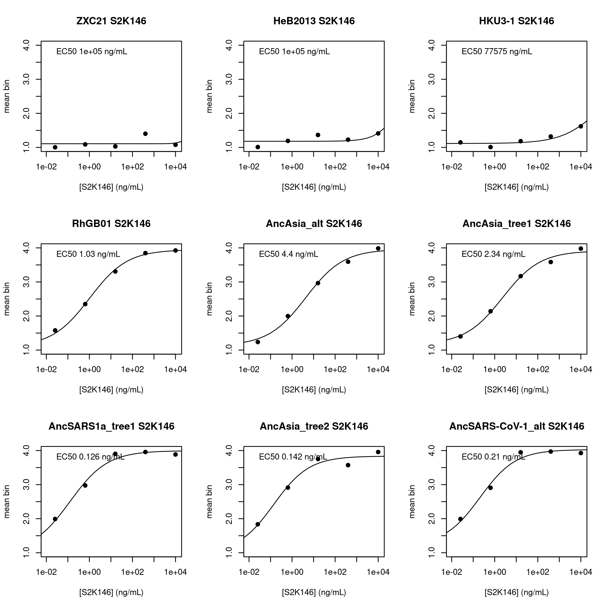

``` r
par(mfrow=c(3,3))
plot.titration(which(dt$EC50_S3L17>=10000)[1],"S3L17")
plot.titration(which(dt$EC50_S3L17>=10000)[2],"S3L17")
plot.titration(which(dt$EC50_S3L17>=10000)[3],"S3L17")
plot.titration(which(dt$EC50_S3L17>1 & dt$EC50_S3L17<10)[1],"S3L17")
plot.titration(which(dt$EC50_S3L17>1 & dt$EC50_S3L17<10)[2],"S3L17")
plot.titration(which(dt$EC50_S3L17>1 & dt$EC50_S3L17<10)[3],"S3L17")
plot.titration(which(dt$EC50_S3L17<1)[1],"S3L17")
plot.titration(which(dt$EC50_S3L17<1)[2],"S3L17")
plot.titration(which(dt$EC50_S3L17<1)[3],"S3L17")
```

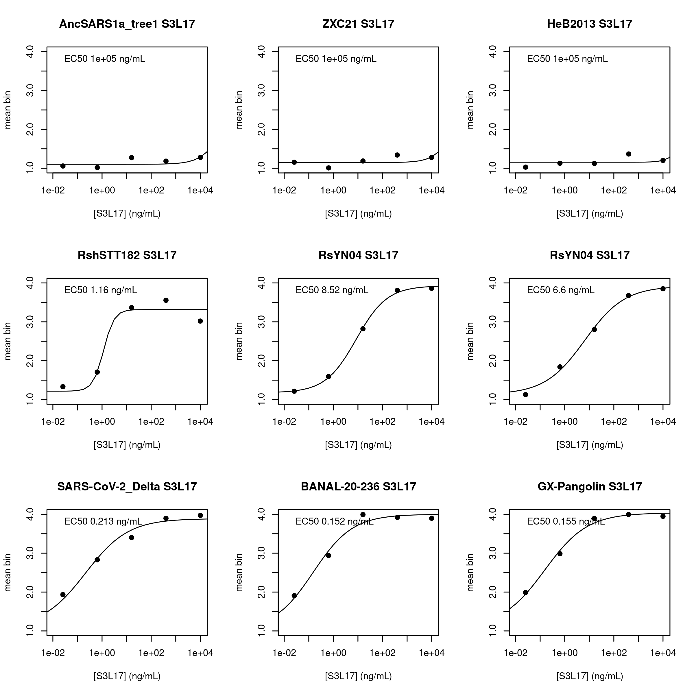

``` r
par(mfrow=c(3,3))
plot.titration(which(dt$EC50_S2V29>=10000)[1],"S2V29")
plot.titration(which(dt$EC50_S2V29>=10000)[2],"S2V29")
plot.titration(which(dt$EC50_S2V29>=10000)[3],"S2V29")
plot.titration(which(dt$EC50_S2V29>1 & dt$EC50_S2V29<10)[1],"S2V29")
plot.titration(which(dt$EC50_S2V29>1 & dt$EC50_S2V29<10)[2],"S2V29")
plot.titration(which(dt$EC50_S2V29>1 & dt$EC50_S2V29<10)[3],"S2V29")
plot.titration(which(dt$EC50_S2V29<0.5)[1],"S2V29")
plot.titration(which(dt$EC50_S2V29<0.5)[2],"S2V29")
plot.titration(which(dt$EC50_S2V29<0.5)[3],"S2V29")
```


``` r
par(mfrow=c(3,3))
plot.titration(which(dt$EC50_S2K146_v860>=10000)[1],"S2K146_v860")
plot.titration(which(dt$EC50_S2K146_v860>=10000)[2],"S2K146_v860")
plot.titration(which(dt$EC50_S2K146_v860>=10000)[3],"S2K146_v860")
plot.titration(which(dt$EC50_S2K146_v860>1 & dt$EC50_S2K146_v860<10)[1],"S2K146_v860")
plot.titration(which(dt$EC50_S2K146_v860>1 & dt$EC50_S2K146_v860<10)[2],"S2K146_v860")
plot.titration(which(dt$EC50_S2K146_v860>1 & dt$EC50_S2K146_v860<10)[3],"S2K146_v860")
plot.titration(which(dt$EC50_S2K146_v860<0.5)[1],"S2K146_v860")
plot.titration(which(dt$EC50_S2K146_v860<0.5)[2],"S2K146_v860")
plot.titration(which(dt$EC50_S2K146_v860<0.5)[3],"S2K146_v860")
```

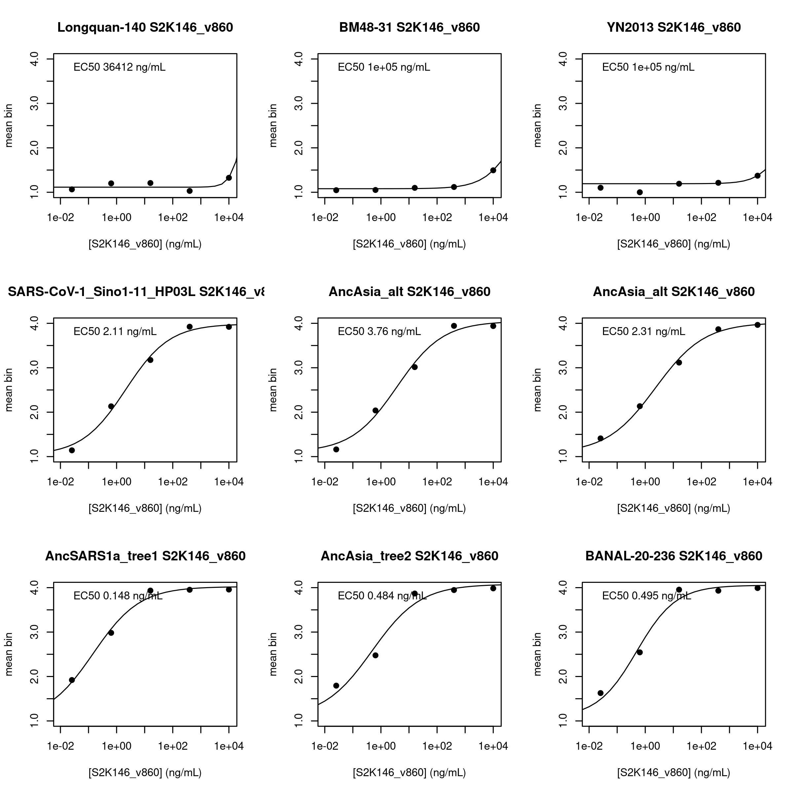

``` r
par(mfrow=c(3,3))
plot.titration(which(dt$EC50_S2V29_v37_2>=10000)[1],"S2V29_v37_2")
plot.titration(which(dt$EC50_S2V29_v37_2>=10000)[2],"S2V29_v37_2")
plot.titration(which(dt$EC50_S2V29_v37_2>=10000)[3],"S2V29_v37_2")
plot.titration(which(dt$EC50_S2V29_v37_2>1 & dt$EC50_S2V29_v37_2<10)[1],"S2V29_v37_2")
plot.titration(which(dt$EC50_S2V29_v37_2>1 & dt$EC50_S2V29_v37_2<10)[2],"S2V29_v37_2")
plot.titration(which(dt$EC50_S2V29_v37_2>1 & dt$EC50_S2V29_v37_2<10)[3],"S2V29_v37_2")
plot.titration(which(dt$EC50_S2V29_v37_2<0.5)[1],"S2V29_v37_2")
plot.titration(which(dt$EC50_S2V29_v37_2<0.5)[2],"S2V29_v37_2")
plot.titration(which(dt$EC50_S2V29_v37_2<0.5)[3],"S2V29_v37_2")
```


``` r
par(mfrow=c(3,3))
plot.titration(which(dt$EC50_S2K146_UCA>=10000)[1],"S2K146_UCA")
plot.titration(which(dt$EC50_S2K146_UCA>=10000)[2],"S2K146_UCA")
plot.titration(which(dt$EC50_S2K146_UCA>=10000)[3],"S2K146_UCA")
plot.titration(which(dt$EC50_S2K146_UCA>1 & dt$EC50_S2K146_UCA<10)[1],"S2K146_UCA")
plot.titration(which(dt$EC50_S2K146_UCA>1 & dt$EC50_S2K146_UCA<10)[2],"S2K146_UCA")
plot.titration(which(dt$EC50_S2K146_UCA>1 & dt$EC50_S2K146_UCA<10)[3],"S2K146_UCA")
plot.titration(which(dt$EC50_S2K146_UCA<0.5)[1],"S2K146_UCA")
plot.titration(which(dt$EC50_S2K146_UCA<0.5)[2],"S2K146_UCA")
plot.titration(which(dt$EC50_S2K146_UCA<0.5)[3],"S2K146_UCA")
```


``` r
par(mfrow=c(3,3))
plot.titration(which(dt$EC50_S3L17_UCA>=10000)[1],"S3L17_UCA")
plot.titration(which(dt$EC50_S3L17_UCA>=10000)[2],"S3L17_UCA")
plot.titration(which(dt$EC50_S3L17_UCA>=10000)[3],"S3L17_UCA")
plot.titration(which(dt$EC50_S3L17_UCA<500 & dt$EC50_S3L17_UCA<100)[1],"S3L17_UCA")
plot.titration(which(dt$EC50_S3L17_UCA<500 & dt$EC50_S3L17_UCA<100)[2],"S3L17_UCA")
plot.titration(which(dt$EC50_S3L17_UCA<500 & dt$EC50_S3L17_UCA<100)[3],"S3L17_UCA")
plot.titration(which(dt$EC50_S3L17_UCA<100)[1],"S3L17_UCA")
plot.titration(which(dt$EC50_S3L17_UCA<100)[2],"S3L17_UCA")
plot.titration(which(dt$EC50_S3L17_UCA<100)[3],"S3L17_UCA")
```


``` r
par(mfrow=c(3,3))
plot.titration(which(dt$EC50_S2V29_UCA>=10000)[1],"S2V29_UCA")
plot.titration(which(dt$EC50_S2V29_UCA>=10000)[2],"S2V29_UCA")
plot.titration(which(dt$EC50_S2V29_UCA>=10000)[3],"S2V29_UCA")
plot.titration(which(dt$EC50_S2V29_UCA>1000 & dt$EC50_S2V29_UCA<10000)[1],"S2V29_UCA")
plot.titration(which(dt$EC50_S2V29_UCA>1000 & dt$EC50_S2V29_UCA<10000)[2],"S2V29_UCA")
plot.titration(which(dt$EC50_S2V29_UCA>1000 & dt$EC50_S2V29_UCA<10000)[3],"S2V29_UCA")
plot.titration(which(dt$EC50_S2V29_UCA<1000)[1],"S2V29_UCA")
plot.titration(which(dt$EC50_S2V29_UCA<1000)[2],"S2V29_UCA")
plot.titration(which(dt$EC50_S2V29_UCA<1000)[3],"S2V29_UCA")
```


``` r
par(mfrow=c(3,3))
plot.titration(which(dt$EC50_S309_887>=10000)[1],"S309_887")
plot.titration(which(dt$EC50_S309_887>=10000)[2],"S309_887")
plot.titration(which(dt$EC50_S309_887>=10000)[3],"S309_887")
plot.titration(which(dt$EC50_S309_887>1 & dt$EC50_S309_887<10)[1],"S309_887")
plot.titration(which(dt$EC50_S309_887>1 & dt$EC50_S309_887<10)[2],"S309_887")
plot.titration(which(dt$EC50_S309_887>1 & dt$EC50_S309_887<10)[3],"S309_887")
plot.titration(which(dt$EC50_S309_887<0.5)[1],"S309_887")
plot.titration(which(dt$EC50_S309_887<0.5)[2],"S309_887")
plot.titration(which(dt$EC50_S309_887<0.5)[3],"S309_887")
```


``` r
par(mfrow=c(3,3))
plot.titration(which(dt$EC50_S2X259>=10000)[1],"S2X259")
plot.titration(which(dt$EC50_S2X259>=10000)[2],"S2X259")
plot.titration(which(dt$EC50_S2X259>=10000)[3],"S2X259")
plot.titration(which(dt$EC50_S2X259>1 & dt$EC50_S2X259<10)[1],"S2X259")
plot.titration(which(dt$EC50_S2X259>1 & dt$EC50_S2X259<10)[2],"S2X259")
plot.titration(which(dt$EC50_S2X259>1 & dt$EC50_S2X259<10)[3],"S2X259")
plot.titration(which(dt$EC50_S2X259<0.5)[1],"S2X259")
plot.titration(which(dt$EC50_S2X259<0.5)[2],"S2X259")
plot.titration(which(dt$EC50_S2X259<0.5)[3],"S2X259")
```


``` r
par(mfrow=c(3,3))
plot.titration(which(dt$EC50_SA55>=10000)[1],"SA55")
plot.titration(which(dt$EC50_SA55>=10000)[2],"SA55")
plot.titration(which(dt$EC50_SA55>=10000)[3],"SA55")
plot.titration(which(dt$EC50_SA55>1 & dt$EC50_SA55<10)[1],"SA55")
plot.titration(which(dt$EC50_SA55>1 & dt$EC50_SA55<10)[2],"SA55")
plot.titration(which(dt$EC50_SA55>1 & dt$EC50_SA55<10)[3],"SA55")
plot.titration(which(dt$EC50_SA55<0.5)[1],"SA55")
plot.titration(which(dt$EC50_SA55<0.5)[2],"SA55")
plot.titration(which(dt$EC50_SA55<0.5)[3],"SA55")
```


``` r
par(mfrow=c(3,3))
plot.titration(which(dt$EC50_Omi42>=10000)[1],"Omi42")
plot.titration(which(dt$EC50_Omi42>=10000)[2],"Omi42")
plot.titration(which(dt$EC50_Omi42>=10000)[3],"Omi42")
plot.titration(which(dt$EC50_Omi42>1 & dt$EC50_Omi42<10)[1],"Omi42")
plot.titration(which(dt$EC50_Omi42>1 & dt$EC50_Omi42<10)[2],"Omi42")
plot.titration(which(dt$EC50_Omi42>1 & dt$EC50_Omi42<10)[3],"Omi42")
plot.titration(which(dt$EC50_Omi42<0.5)[1],"Omi42")
plot.titration(which(dt$EC50_Omi42<0.5)[2],"Omi42")
plot.titration(which(dt$EC50_Omi42<0.5)[3],"Omi42")
```


``` r
par(mfrow=c(3,3))
plot.titration(which(dt$EC50_S309>=10000)[1],"S309")
plot.titration(which(dt$EC50_S309>=10000)[2],"S309")
plot.titration(which(dt$EC50_S309>=10000)[3],"S309")
plot.titration(which(dt$EC50_S309>1 & dt$EC50_S309<10)[1],"S309")
plot.titration(which(dt$EC50_S309>1 & dt$EC50_S309<10)[2],"S309")
plot.titration(which(dt$EC50_S309>1 & dt$EC50_S309<10)[3],"S309")
plot.titration(which(dt$EC50_S309<0.5)[1],"S309")
plot.titration(which(dt$EC50_S309<0.5)[2],"S309")
plot.titration(which(dt$EC50_S309<0.5)[3],"S309")
```


## Data filtering by fit quality

Next, let’s filter out poor fits using the value we previously computed,
the *normalized* mean square residual (nMSR). This metric computes the
residual between the observed response variable and that predicted from
the titration fit, normalizes this residual by the response range of the
titration fit (which is allowed to vary between 1.5 and 3 per the
titration fits above), and computes the mean-square of these normalized
residuals.

Distribution of the nMSR metric in each set of fits

``` r
par(mfrow=c(3,3))
hist(dt$nMSR_S2K146,main="S2K146",xlab="Response-normalized mean squared residual",col="gray50",breaks=40,xlim=c(0,0.6))
hist(dt$nMSR_S3L17,main="S3L17",xlab="Response-normalized mean squared residual",col="gray50",breaks=40,xlim=c(0,0.6))
hist(dt$nMSR_S2V29,main="S2V29",xlab="Response-normalized mean squared residual",col="gray50",breaks=40,xlim=c(0,0.6))
hist(dt$nMSR_S2K146_v860,main="S2K146_v860",xlab="Response-normalized mean squared residual",col="gray50",breaks=40,xlim=c(0,0.6))
hist(dt$nMSR_S2V29_v37_2,main="S2V29_v37_2",xlab="Response-normalized mean squared residual",col="gray50",breaks=40,xlim=c(0,0.6))
hist(dt$nMSR_S2K146_UCA,main="S2K146_UCA",xlab="Response-normalized mean squared residual",col="gray50",breaks=40,xlim=c(0,0.6))
hist(dt$nMSR_S3L17_UCA,main="S3L17_UCA",xlab="Response-normalized mean squared residual",col="gray50",breaks=40,xlim=c(0,0.6))
hist(dt$nMSR_S2V29_UCA,main="S2V29_UCA",xlab="Response-normalized mean squared residual",col="gray50",breaks=40,xlim=c(0,0.6))
hist(dt$nMSR_S309_887,main="S309_887",xlab="Response-normalized mean squared residual",col="gray50",breaks=40,xlim=c(0,0.6))
```

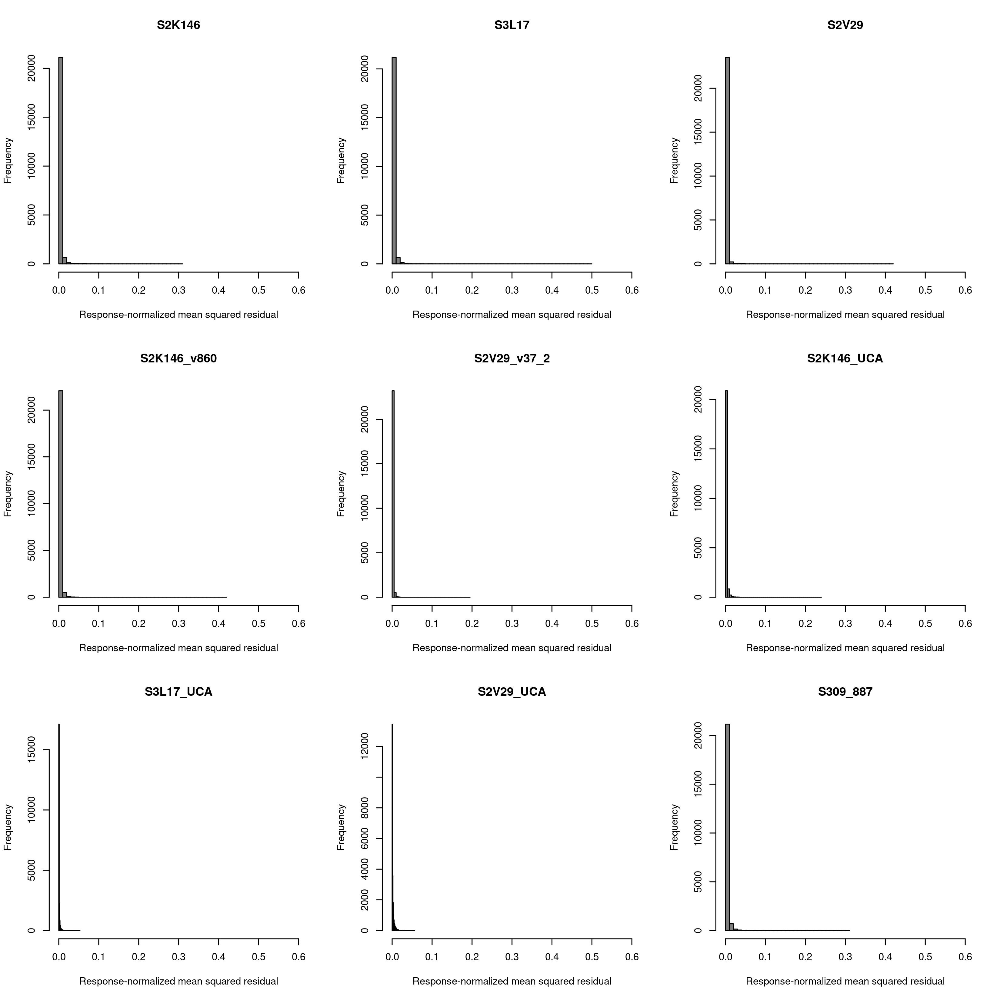

``` r
hist(dt$nMSR_S2X259,main="S2X259",xlab="Response-normalized mean squared residual",col="gray50",breaks=40,xlim=c(0,0.6))
hist(dt$nMSR_SA55,main="SA55",xlab="Response-normalized mean squared residual",col="gray50",breaks=40,xlim=c(0,0.6))
hist(dt$nMSR_Omi42,main="Omi42",xlab="Response-normalized mean squared residual",col="gray50",breaks=40,xlim=c(0,0.6))
hist(dt$nMSR_S309,main="S309",xlab="Response-normalized mean squared residual",col="gray50",breaks=40,xlim=c(0,0.6))
```

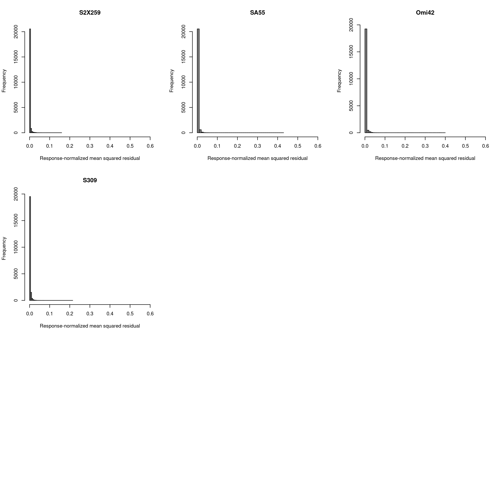

As we would expect, the MSR stat decreases with cell count, indicating
that higher cell counts leads to better curve fits. Also show the cutoff
I’m proposing for nMSR (20x median across all fits), legend gives
percent of curve fits eliminated

``` r
median.nMSR <- median(c(dt$nMSR_S2K146,dt$nMSR_S3L17,dt$nMSR_S2V29,dt$nMSR_S2K146_v860, dt$nMSR_S2V29_v37_2, 
                        dt$nMSR_S2K146_UCA, dt$nMSR_S3L17_UCA, dt$nMSR_S2V29_UCA, dt$nMSR_S309_887,
                        dt$nMSR_S2X259, dt$nMSR_SA55, dt$nMSR_Omi42, dt$nMSR_S309),na.rm=T)

par(mfrow=c(4,4))
plot(log10(dt$`S2K146_avgcount`),dt$nMSR_S2K146,main="S2K146",pch=19,col="#00000010",xlab="average cell count (log10)",ylab="nMSR",xlim=c(1,4),ylim=c(0,0.6))
abline(h=20*median.nMSR,col="red",lty=2)
legend("topleft",bty="n",cex=1,legend=paste(format(100*nrow(dt[nMSR_S2K146 > 10*median.nMSR & !is.na(nMSR_S2K146),])/nrow(dt[!is.na(nMSR_S2K146),]),digits=3),"%"))

plot(log10(dt$`S3L17_avgcount`),dt$nMSR_S3L17,main="S3L17",pch=19,col="#00000010",xlab="average cell count (log10)",ylab="nMSR",xlim=c(1,4),ylim=c(0,0.6))
abline(h=20*median.nMSR,col="red",lty=2)
legend("topleft",bty="n",cex=1,legend=paste(format(100*nrow(dt[nMSR_S3L17 > 10*median.nMSR & !is.na(nMSR_S3L17),])/nrow(dt[!is.na(nMSR_S3L17),]),digits=3),"%"))

plot(log10(dt$`S2V29_avgcount`),dt$nMSR_S2V29,main="S2V29",pch=19,col="#00000010",xlab="average cell count (log10)",ylab="nMSR",xlim=c(1,4),ylim=c(0,0.6))
abline(h=20*median.nMSR,col="red",lty=2)
legend("topleft",bty="n",cex=1,legend=paste(format(100*nrow(dt[nMSR_S2V29 > 10*median.nMSR & !is.na(nMSR_S2V29),])/nrow(dt[!is.na(nMSR_S2V29),]),digits=3),"%"))

plot(log10(dt$`S2K146_v860_avgcount`),dt$nMSR_S2K146_v860,main="S2K146_v860",pch=19,col="#00000010",xlab="average cell count (log10)",ylab="nMSR",xlim=c(1,4),ylim=c(0,0.6))
abline(h=20*median.nMSR,col="red",lty=2)
legend("topleft",bty="n",cex=1,legend=paste(format(100*nrow(dt[nMSR_S2K146_v860 > 10*median.nMSR & !is.na(nMSR_S2K146_v860),])/nrow(dt[!is.na(nMSR_S2K146_v860),]),digits=3),"%"))

plot(log10(dt$`S2V29_v37_2_avgcount`),dt$nMSR_S2V29_v37_2,main="S2V29_v37_2",pch=19,col="#00000010",xlab="average cell count (log10)",ylab="nMSR",xlim=c(1,4),ylim=c(0,0.6))
abline(h=20*median.nMSR,col="red",lty=2)
legend("topleft",bty="n",cex=1,legend=paste(format(100*nrow(dt[nMSR_S2V29_v37_2 > 10*median.nMSR & !is.na(nMSR_S2V29_v37_2),])/nrow(dt[!is.na(nMSR_S2V29_v37_2),]),digits=3),"%"))

plot(log10(dt$`S2K146_UCA_avgcount`),dt$nMSR_S2K146_UCA,main="S2K146_UCA",pch=19,col="#00000010",xlab="average cell count (log10)",ylab="nMSR",xlim=c(1,4),ylim=c(0,0.6))
abline(h=20*median.nMSR,col="red",lty=2)
legend("topleft",bty="n",cex=1,legend=paste(format(100*nrow(dt[nMSR_S2K146_UCA > 10*median.nMSR & !is.na(nMSR_S2K146_UCA),])/nrow(dt[!is.na(nMSR_S2K146_UCA),]),digits=3),"%"))

plot(log10(dt$`S3L17_UCA_avgcount`),dt$nMSR_S3L17_UCA,main="S3L17_UCA",pch=19,col="#00000010",xlab="average cell count (log10)",ylab="nMSR",xlim=c(1,4),ylim=c(0,0.6))
abline(h=20*median.nMSR,col="red",lty=2)
legend("topleft",bty="n",cex=1,legend=paste(format(100*nrow(dt[nMSR_S3L17_UCA > 10*median.nMSR & !is.na(nMSR_S3L17_UCA),])/nrow(dt[!is.na(nMSR_S3L17_UCA),]),digits=3),"%"))

plot(log10(dt$`S2V29_UCA_avgcount`),dt$nMSR_S2V29_UCA,main="S2V29_UCA",pch=19,col="#00000010",xlab="average cell count (log10)",ylab="nMSR",xlim=c(1,4),ylim=c(0,0.6))
abline(h=20*median.nMSR,col="red",lty=2)
legend("topleft",bty="n",cex=1,legend=paste(format(100*nrow(dt[nMSR_S2V29_UCA > 10*median.nMSR & !is.na(nMSR_S2V29_UCA),])/nrow(dt[!is.na(nMSR_S2V29_UCA),]),digits=3),"%"))

plot(log10(dt$`S309_887_avgcount`),dt$nMSR_S309_887,main="S309_887",pch=19,col="#00000010",xlab="average cell count (log10)",ylab="nMSR",xlim=c(1,4),ylim=c(0,0.6))
abline(h=20*median.nMSR,col="red",lty=2)
legend("topleft",bty="n",cex=1,legend=paste(format(100*nrow(dt[nMSR_S309_887 > 10*median.nMSR & !is.na(nMSR_S309_887),])/nrow(dt[!is.na(nMSR_S309_887),]),digits=3),"%"))

plot(log10(dt$`S2X259_avgcount`),dt$nMSR_S2X259,main="S2X259",pch=19,col="#00000010",xlab="average cell count (log10)",ylab="nMSR",xlim=c(1,4),ylim=c(0,0.6))
abline(h=20*median.nMSR,col="red",lty=2)
legend("topleft",bty="n",cex=1,legend=paste(format(100*nrow(dt[nMSR_S2X259 > 10*median.nMSR & !is.na(nMSR_S2X259),])/nrow(dt[!is.na(nMSR_S2X259),]),digits=3),"%"))

plot(log10(dt$`SA55_avgcount`),dt$nMSR_SA55,main="SA55",pch=19,col="#00000010",xlab="average cell count (log10)",ylab="nMSR",xlim=c(1,4),ylim=c(0,0.6))
abline(h=20*median.nMSR,col="red",lty=2)
legend("topleft",bty="n",cex=1,legend=paste(format(100*nrow(dt[nMSR_SA55 > 10*median.nMSR & !is.na(nMSR_SA55),])/nrow(dt[!is.na(nMSR_SA55),]),digits=3),"%"))

plot(log10(dt$`Omi42_avgcount`),dt$nMSR_Omi42,main="Omi42",pch=19,col="#00000010",xlab="average cell count (log10)",ylab="nMSR",xlim=c(1,4),ylim=c(0,0.6))
abline(h=20*median.nMSR,col="red",lty=2)
legend("topleft",bty="n",cex=1,legend=paste(format(100*nrow(dt[nMSR_Omi42 > 10*median.nMSR & !is.na(nMSR_Omi42),])/nrow(dt[!is.na(nMSR_Omi42),]),digits=3),"%"))

plot(log10(dt$`S309_avgcount`),dt$nMSR_S309,main="S309",pch=19,col="#00000010",xlab="average cell count (log10)",ylab="nMSR",xlim=c(1,4),ylim=c(0,0.6))
abline(h=20*median.nMSR,col="red",lty=2)
legend("topleft",bty="n",cex=1,legend=paste(format(100*nrow(dt[nMSR_S309 > 10*median.nMSR & !is.na(nMSR_S309),])/nrow(dt[!is.na(nMSR_S309),]),digits=3),"%"))
```

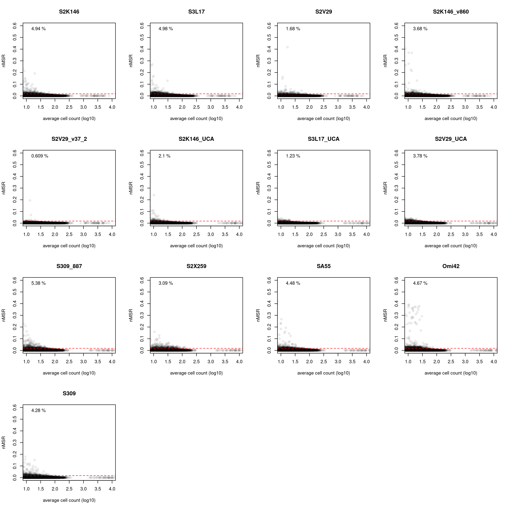

Next, we will apply this filtering step on normalized MSR, removing
curves with nMSR \>20x the median across all experiments

``` r
dt[nMSR_S2K146 > 20*median.nMSR,c("EC50_S2K146","EC50_SE_S2K146","response_S2K146","baseline_S2K146") := list(as.numeric(NA),as.numeric(NA),as.numeric(NA),as.numeric(NA))]

dt[nMSR_S3L17 > 20*median.nMSR,c("EC50_S3L17","EC50_SE_S3L17","response_S3L17","baseline_S3L17") := list(as.numeric(NA),as.numeric(NA),as.numeric(NA),as.numeric(NA))]

dt[nMSR_S2V29 > 20*median.nMSR,c("EC50_S2V29","EC50_SE_S2V29","response_S2V29","baseline_S2V29") := list(as.numeric(NA),as.numeric(NA),as.numeric(NA),as.numeric(NA))]

dt[nMSR_S2K146_v860 > 20*median.nMSR,c("EC50_S2K146_v860","EC50_SE_S2K146_v860","response_S2K146_v860","baseline_S2K146_v860") := list(as.numeric(NA),as.numeric(NA),as.numeric(NA),as.numeric(NA))]

dt[nMSR_S2V29_v37_2 > 20*median.nMSR,c("EC50_S2V29_v37_2","EC50_SE_S2V29_v37_2","response_S2V29_v37_2","baseline_S2V29_v37_2") := list(as.numeric(NA),as.numeric(NA),as.numeric(NA),as.numeric(NA))]

dt[nMSR_S2K146_UCA > 20*median.nMSR,c("EC50_S2K146_UCA","EC50_SE_S2K146_UCA","response_S2K146_UCA","baseline_S2K146_UCA") := list(as.numeric(NA),as.numeric(NA),as.numeric(NA),as.numeric(NA))]

dt[nMSR_S3L17_UCA > 20*median.nMSR,c("EC50_S3L17_UCA","EC50_SE_S3L17_UCA","response_S3L17_UCA","baseline_S3L17_UCA") := list(as.numeric(NA),as.numeric(NA),as.numeric(NA),as.numeric(NA))]

dt[nMSR_S2V29_UCA > 20*median.nMSR,c("EC50_S2V29_UCA","EC50_SE_S2V29_UCA","response_S2V29_UCA","baseline_S2V29_UCA") := list(as.numeric(NA),as.numeric(NA),as.numeric(NA),as.numeric(NA))]

dt[nMSR_S309_887 > 20*median.nMSR,c("EC50_S309_887","EC50_SE_S309_887","response_S309_887","baseline_S309_887") := list(as.numeric(NA),as.numeric(NA),as.numeric(NA),as.numeric(NA))]

dt[nMSR_S2X259 > 20*median.nMSR,c("EC50_S2X259","EC50_SE_S2X259","response_S2X259","baseline_S2X259") := list(as.numeric(NA),as.numeric(NA),as.numeric(NA),as.numeric(NA))]

dt[nMSR_SA55 > 20*median.nMSR,c("EC50_SA55","EC50_SE_SA55","response_SA55","baseline_SA55") := list(as.numeric(NA),as.numeric(NA),as.numeric(NA),as.numeric(NA))]

dt[nMSR_Omi42 > 20*median.nMSR,c("EC50_Omi42","EC50_SE_Omi42","response_Omi42","baseline_Omi42") := list(as.numeric(NA),as.numeric(NA),as.numeric(NA),as.numeric(NA))]

dt[nMSR_S309 > 20*median.nMSR,c("EC50_S309","EC50_SE_S309","response_S309","baseline_S309") := list(as.numeric(NA),as.numeric(NA),as.numeric(NA),as.numeric(NA))]
```

## Final scores

Let’s visualize the EC50 binding measurements as violin plots for the
different wildtype targets, for each serum metric.

``` r
p1 <- ggplot(dt[!is.na(EC50_S2K146),],aes(x=target,y=EC50_S2K146))+
  geom_violin(scale="width")+stat_summary(fun=median,geom="point",size=1)+
  ggtitle("S2K146 EC50")+xlab("target")+theme(axis.text.x=element_text(angle=-90,hjust=0))+
  facet_wrap(~library,nrow=1)+
  scale_y_log10()

grid.arrange(p1,ncol=1)
```

    ## Warning: Groups with fewer than two data points have been dropped.

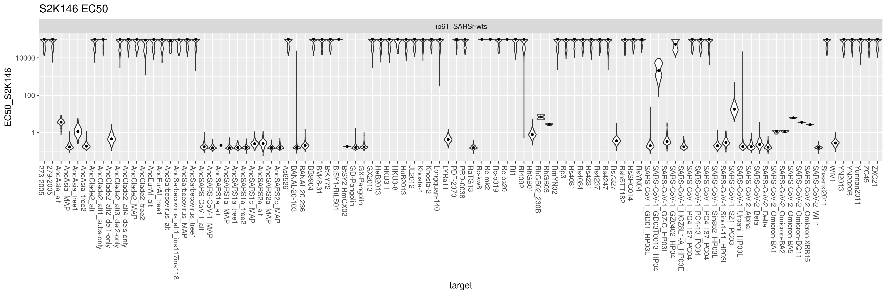

``` r
#save pdf
invisible(dev.print(pdf, paste(config$mAb_EC50_dir,"/violin-plot_EC50-by-target_S2K146.pdf",sep="")))
```

``` r
p1 <- ggplot(dt[!is.na(EC50_S3L17),],aes(x=target,y=EC50_S3L17))+
  geom_violin(scale="width")+stat_summary(fun=median,geom="point",size=1)+
  ggtitle("S3L17 EC50")+xlab("target")+theme(axis.text.x=element_text(angle=-90,hjust=0))+
  facet_wrap(~library,nrow=1)+
  scale_y_log10()

grid.arrange(p1,ncol=1)
```

    ## Warning: Groups with fewer than two data points have been dropped.


``` r
#save pdf
invisible(dev.print(pdf, paste(config$mAb_EC50_dir,"/violin-plot_EC50-by-target_S3L17.pdf",sep="")))
```

``` r
p1 <- ggplot(dt[!is.na(EC50_S2V29),],aes(x=target,y=EC50_S2V29))+
  geom_violin(scale="width")+stat_summary(fun=median,geom="point",size=1)+
  ggtitle("S2V29 EC50")+xlab("target")+theme(axis.text.x=element_text(angle=-90,hjust=0))+
  facet_wrap(~library,nrow=1)+
  scale_y_log10()

grid.arrange(p1,ncol=1)
```


``` r
#save pdf
invisible(dev.print(pdf, paste(config$mAb_EC50_dir,"/violin-plot_EC50-by-target_S2V29.pdf",sep="")))
```

``` r
p1 <- ggplot(dt[!is.na(EC50_S2K146_v860),],aes(x=target,y=EC50_S2K146_v860))+
  geom_violin(scale="width")+stat_summary(fun=median,geom="point",size=1)+
  ggtitle("S2K146_v860 EC50")+xlab("target")+theme(axis.text.x=element_text(angle=-90,hjust=0))+
  facet_wrap(~library,nrow=1)+
  scale_y_log10()

grid.arrange(p1,ncol=1)
```

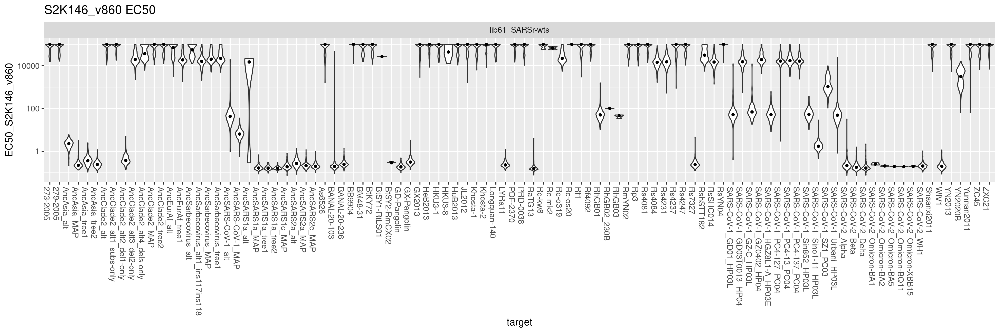

``` r
#save pdf
invisible(dev.print(pdf, paste(config$mAb_EC50_dir,"/violin-plot_EC50-by-target_S2K146_v860.pdf",sep="")))
```

``` r
p1 <- ggplot(dt[!is.na(EC50_S2V29_v37_2),],aes(x=target,y=EC50_S2V29_v37_2))+
  geom_violin(scale="width")+stat_summary(fun=median,geom="point",size=1)+
  ggtitle("S2V29_v37_2 EC50")+xlab("target")+theme(axis.text.x=element_text(angle=-90,hjust=0))+
  facet_wrap(~library,nrow=1)+
  scale_y_log10()

grid.arrange(p1,ncol=1)
```


``` r
#save pdf
invisible(dev.print(pdf, paste(config$mAb_EC50_dir,"/violin-plot_EC50-by-target_S2V29_v37_2.pdf",sep="")))
```

``` r
p1 <- ggplot(dt[!is.na(EC50_S2K146_UCA),],aes(x=target,y=EC50_S2K146_UCA))+
  geom_violin(scale="width")+stat_summary(fun=median,geom="point",size=1)+
  ggtitle("S2K146_UCA EC50")+xlab("target")+theme(axis.text.x=element_text(angle=-90,hjust=0))+
  facet_wrap(~library,nrow=1)+
  scale_y_log10()

grid.arrange(p1,ncol=1)
```


``` r
#save pdf
invisible(dev.print(pdf, paste(config$mAb_EC50_dir,"/violin-plot_EC50-by-target_S2K146_UCA.pdf",sep="")))
```

``` r
p1 <- ggplot(dt[!is.na(EC50_S3L17_UCA),],aes(x=target,y=EC50_S3L17_UCA))+
  geom_violin(scale="width")+stat_summary(fun=median,geom="point",size=1)+
  ggtitle("S3L17_UCA EC50")+xlab("target")+theme(axis.text.x=element_text(angle=-90,hjust=0))+
  facet_wrap(~library,nrow=1)+
  scale_y_log10()

grid.arrange(p1,ncol=1)
```


``` r
#save pdf
invisible(dev.print(pdf, paste(config$mAb_EC50_dir,"/violin-plot_EC50-by-target_S3L17_UCA.pdf",sep="")))
```

``` r
p1 <- ggplot(dt[!is.na(EC50_S2V29_UCA),],aes(x=target,y=EC50_S2V29_UCA))+
  geom_violin(scale="width")+stat_summary(fun=median,geom="point",size=1)+
  ggtitle("S2V29_UCA EC50")+xlab("target")+theme(axis.text.x=element_text(angle=-90,hjust=0))+
  facet_wrap(~library,nrow=1)+
  scale_y_log10()

grid.arrange(p1,ncol=1)
```

    ## Warning: Groups with fewer than two data points have been dropped.


``` r
#save pdf
invisible(dev.print(pdf, paste(config$mAb_EC50_dir,"/violin-plot_EC50-by-target_S2V29_UCA.pdf",sep="")))
```

``` r
p1 <- ggplot(dt[!is.na(EC50_S309_887),],aes(x=target,y=EC50_S309_887))+
  geom_violin(scale="width")+stat_summary(fun=median,geom="point",size=1)+
  ggtitle("S309_887 EC50")+xlab("target")+theme(axis.text.x=element_text(angle=-90,hjust=0))+
  facet_wrap(~library,nrow=1)+
  scale_y_log10()

grid.arrange(p1,ncol=1)
```

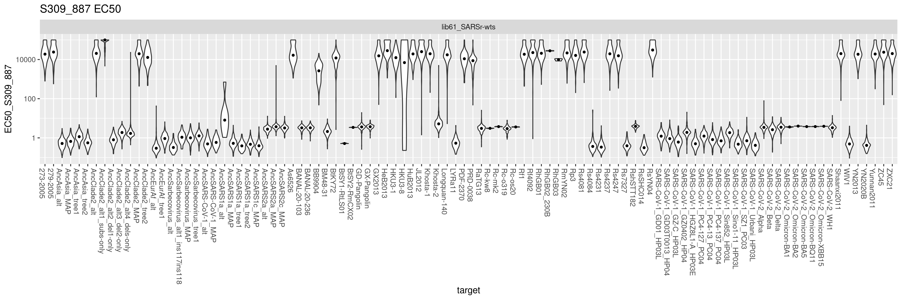

``` r
#save pdf
invisible(dev.print(pdf, paste(config$mAb_EC50_dir,"/violin-plot_EC50-by-target_S309_887.pdf",sep="")))
```

``` r
p1 <- ggplot(dt[!is.na(EC50_S2X259),],aes(x=target,y=EC50_S2X259))+
  geom_violin(scale="width")+stat_summary(fun=median,geom="point",size=1)+
  ggtitle("S2X259 EC50")+xlab("target")+theme(axis.text.x=element_text(angle=-90,hjust=0))+
  facet_wrap(~library,nrow=1)+
  scale_y_log10()

grid.arrange(p1,ncol=1)
```

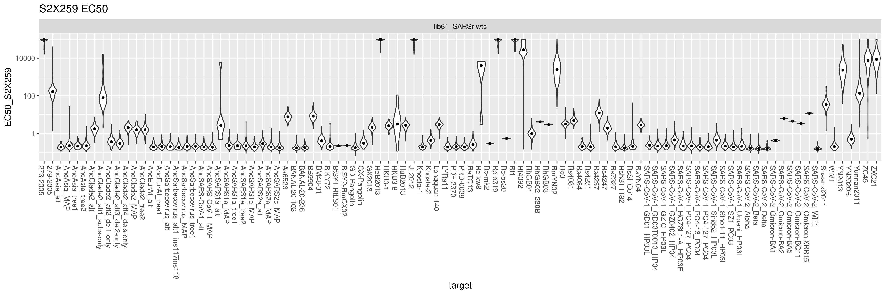

``` r
#save pdf
invisible(dev.print(pdf, paste(config$mAb_EC50_dir,"/violin-plot_EC50-by-target_S2X259.pdf",sep="")))
```

``` r
p1 <- ggplot(dt[!is.na(EC50_SA55),],aes(x=target,y=EC50_SA55))+
  geom_violin(scale="width")+stat_summary(fun=median,geom="point",size=1)+
  ggtitle("SA55 EC50")+xlab("target")+theme(axis.text.x=element_text(angle=-90,hjust=0))+
  facet_wrap(~library,nrow=1)+
  scale_y_log10()

grid.arrange(p1,ncol=1)
```


``` r
#save pdf
invisible(dev.print(pdf, paste(config$mAb_EC50_dir,"/violin-plot_EC50-by-target_SA55.pdf",sep="")))
```

``` r
p1 <- ggplot(dt[!is.na(EC50_Omi42),],aes(x=target,y=EC50_Omi42))+
  geom_violin(scale="width")+stat_summary(fun=median,geom="point",size=1)+
  ggtitle("Omi42 EC50")+xlab("target")+theme(axis.text.x=element_text(angle=-90,hjust=0))+
  facet_wrap(~library,nrow=1)+
  scale_y_log10()

grid.arrange(p1,ncol=1)
```


``` r
#save pdf
invisible(dev.print(pdf, paste(config$mAb_EC50_dir,"/violin-plot_EC50-by-target_Omi42.pdf",sep="")))
```

``` r
p1 <- ggplot(dt[!is.na(EC50_S309),],aes(x=target,y=EC50_S309))+
  geom_violin(scale="width")+stat_summary(fun=median,geom="point",size=1)+
  ggtitle("S309 EC50")+xlab("target")+theme(axis.text.x=element_text(angle=-90,hjust=0))+
  facet_wrap(~library,nrow=1)+
  scale_y_log10()

grid.arrange(p1,ncol=1)
```

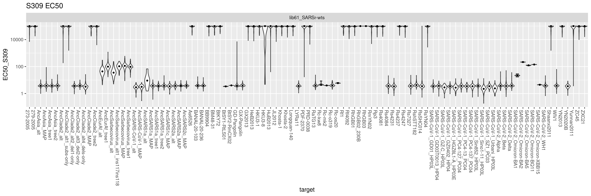

``` r
#save pdf
invisible(dev.print(pdf, paste(config$mAb_EC50_dir,"/violin-plot_EC50-by-target_S309.pdf",sep="")))
```

## Save barcode-level metrics

In the next script, we will collapse bcs down to final
mutant/variant-level phenotypes, integrate things like expression
effects of variants, and visualize final phenotypes.

``` r
dt[,.(library,barcode,target,variant_class,
     `S2V29_v37_2_avgcount`,EC50_S2V29_v37_2,
     `S2V29_avgcount`,EC50_S2V29,
     `S2V29_UCA_avgcount`,EC50_S2V29_UCA,
     `S2K146_v860_avgcount`,EC50_S2K146_v860,
     `S2K146_avgcount`,EC50_S2K146,
     `S2K146_UCA_avgcount`,EC50_S2K146_UCA,
     `S3L17_avgcount`,EC50_S3L17,
     `S3L17_UCA_avgcount`,EC50_S3L17_UCA,
     `S309_887_avgcount`,EC50_S309_887,
     `S309_avgcount`,EC50_S309,
     `S2X259_avgcount`,EC50_S2X259,
     `SA55_avgcount`,EC50_SA55,
     `Omi42_avgcount`,EC50_Omi42)] %>%
  mutate_if(is.numeric, round, digits=6) %>%
  write.csv(file=config$mAb_EC50_file, row.names=F)
```
